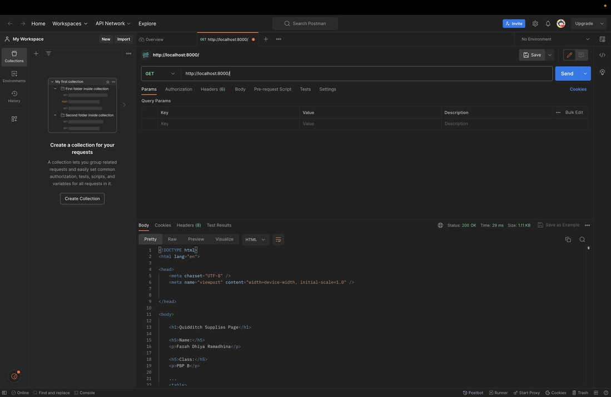

# Tugas 4: Implementasi Autentikasi, Session, dan Cookies pada Django #
## Farah Dhiya Ramadhina/PBP B/2206082934 ##

## A. Apa itu Django UserCreationForm, dan jelaskan apa kelebihan dan kekurangannya? ##
Django `UserCreationForm` adalah salah satu komponen dari kerangka kerja Django yang digunakan untuk **membuat form pendaftaran *user* dalam aplikasi web.** Kelebihan dari `UserCreationForm` adalah **kemudahannya dalam menghasilkan form pendaftaran *user* yang lengkap dengan validasi bawaan**, sehingga *developer* dapat menghemat waktu dalam mengimplementasikan fitur pendaftaran. Form ini juga terintegrasi dengan Django's authentication system, sehingga *user* yang terdaftar dapat dengan mudah masuk ke aplikasi. Kekurangan dari `UserCreationForm` adalah **kurangnya fleksibilitas dalam desain tampilan form**, sehingga mungkin diperlukan kustomisasi tambahan untuk mencocokkan tampilan dengan desain aplikasi yang spesifik.

## B. Apa perbedaan antara autentikasi dan otorisasi dalam konteks Django, dan mengapa keduanya penting? ##
Autentikasi dan otorisasi adalah dua konsep penting dalam pengembangan aplikasi web dengan Django. 

**Autentikasi** adalah proses memeriksa identitas *user* yang mencoba mengakses sistem, biasanya dengan menggunakan *username* dan *password* 

**Otorisasi** adalah proses mengendalikan akses *user* terhadap sumber daya atau tindakan tertentu dalam aplikasi, seperti apakah mereka memiliki izin untuk melihat halaman tertentu atau melakukan tindakan tertentu.

Keduanya penting karena autentikasi memastikan bahwa *user* yang masuk adalah mereka yang mengklaim menjadi diri mereka sendiri, sementara otorisasi memastikan bahwa *user* hanya memiliki akses ke bagian aplikasi yang sesuai dengan peran dan izin mereka. Dengan kata lain, autentikasi menangani "siapa," sedangkan otorisasi menangani "apa yang diizinkan."

## C. Apa itu *cookies* dalam konteks aplikasi web, dan bagaimana Django menggunakan cookies untuk mengelola data sesi pengguna? ##
***Cookies*** adalah file kecil yang disimpan di komputer *user* oleh server web dan digunakan untuk menyimpan informasi sesi atau data lainnya dalam konteks aplikasi web. Django menggunakan *cookies* untuk mengelola data sesi *user* dengan cara menyimpan ID sesi *user* di *cookie*. Ketika *user* melakukan permintaan ke server, server dapat mengidentifikasi pengguna berdasarkan ID sesi yang ada di *cookie* dan mengembalikan data sesi yang sesuai.

## D. Apakah penggunaan *cookies* aman secara *default* dalam pengembangan web, atau apakah ada risiko potensial yang harus diwaspadai? ##
Secara *default*, penggunaan *cookies* dalam pengembangan web tidak selalu aman. Ada beberapa risiko yang harus diwaspadai, seperti:

   - **Cross-Site Scripting (XSS):** Jika aplikasi web rentan terhadap serangan `XSS`, *attacker* dapat mencuri atau memanipulasi data dalam *cookies* pengguna.

   - **Session Hijacking:** Jika sesi *user* dapat diakses oleh *attacker*, mereka dapat mencuri ID sesi dan mengakses akun *user* tanpa izin.

   - **Data Sensitif:** Menyimpan data sensitif seperti kata sandi atau informasi pribadi dalam *cookies* dapat menjadi risiko jika *cookies* dicuri.

Untuk meningkatkan keamanan, penting untuk mengimplementasikan praktik-praktik keamanan seperti **enkripsi data dalam *cookies*, penggunaan `HttpOnly` dan `Secure flags`, serta perlindungan terhadap `XSS`**. Django memiliki alat dan praktik yang direkomendasikan untuk mengelola *cookies* dengan aman, dan penting untuk mengikuti pedoman keamanan yang disediakan oleh Django dalam menggunakannya.

## E. Implementasi Checklist *step-by-step*. ##
### Mengimplementasikan fungsi registrasi, login, dan logout untuk memungkinkan pengguna untuk mengakses aplikasi sebelumnya dengan lancar. ###
* Mengaktifkan virtual environment dengan menjalankan *prompt* berikut pada terminal direktori aplikasi kita `source env/bin/activate`.

**Fungsi Registrasi**
* Buka `views.py` yang ada pada `main` dan tambahkan import `redirect`, `UserCreationForm`, dan `messages`
* Buat fungsi `register` seperti berikut yg menerima parameter `request`
```ruby
from django.shortcuts import redirect
from django.contrib.auth.forms import UserCreationForm
from django.contrib import messages  

def register(request):
    form = UserCreationForm()

    if request.method == "POST":
        form = UserCreationForm(request.POST)
        if form.is_valid():
            form.save()
            messages.success(request, 'Your account has been successfully created!')
            return redirect('main:login')
    context = {'form':form}
    return render(request, 'register.html', context)
```
* Buat file HTML baru bernama `register.html` pada folder `main/templates` dan isi file dengan kode berikut :
```ruby



    <title>Register</title>


  

<div class = "login">
    
    <h1>Register</h1>  

        <form method="POST" >  
              
            <table>  
                {{ form.as_table }}  
                <tr>  
                    <td></td>
                    <td><input type="submit" name="submit" value="Daftar"/></td>  
                </tr>  
            </table>  
        </form>

      
        <ul>   
              
                <li>{{ message }}</li>  
                  
        </ul>   
    

</div>  


```
* Buka file `urls.py` pada `main` dan import fungsi yg telah kita buat 
```ruby
from main.views import register
```
* Tambah *path url* dalam `urlpatterns` ubtuk mengakses fungsi yg telah diimport sebelumnya
```ruby
...
path('register/', register, name='register'), 
```

**Fungsi Login**
* Buka `views.py` yang ada pada `main` dan tambahkan import `authenticate` dan `login`
* Buat fungsi `login_user` seperti berikut yg menerima parameter `request`
```ruby
def login_user(request):
    if request.method == 'POST':
        username = request.POST.get('username')
        password = request.POST.get('password')
        user = authenticate(request, username=username, password=password)
        if user is not None:
            login(request, user)
            return redirect('main:show_main')
        else:
            messages.info(request, 'Sorry, incorrect username or password. Please try again.')
    context = {}
    return render(request, 'login.html', context)
```
* Buat file HTML baru bernama `login.html` pada folder `main/templates` dan isi file dengan kode berikut :
```ruby



    <title>Login</title>




<div class = "login">

    <h1>Login</h1>

    <form method="POST" action="">
        
        <table>
            <tr>
                <td>Username: </td>
                <td><input type="text" name="username" placeholder="Username" class="form-control"></td>
            </tr>
                    
            <tr>
                <td>Password: </td>
                <td><input type="password" name="password" placeholder="Password" class="form-control"></td>
            </tr>

            <tr>
                <td></td>
                <td><input class="btn login_btn" type="submit" value="Login"></td>
            </tr>
        </table>
    </form>

    
        <ul>
            
                <li>{{ message }}</li>
            
        </ul>
         
        
    Don't have an account yet? <a href="">Register Now</a>

</div>


```
* Buka file `urls.py` pada `main` dan import fungsi yg telah kita buat 
```ruby
from main.views import login_user
```
* Tambah *path url* dalam `urlpatterns` ubtuk mengakses fungsi yg telah diimport sebelumnya
```ruby
...
path('login/', login_user, name='login'), 
```

**Fungsi Logout**
* Buka `views.py` yang ada pada `main` dan buat fungsi bernama `logout_user` seperti berikut yg menerima parameter `request` serta tambahkan import `logout`
```ruby
from django.contrib.auth import logout

def logout_user(request):
    logout(request)
    return redirect('main:login')
```
* Buka `main.html` pada folder `main/templates` dan tambahkan potongan kode berikut setelah *hyperlink tag* untuk *Add New Product*:
```ruby
...
<a href="">
    <button>
        Logout
    </button>
</a>
...
```
* Buka file `urls.py` pada `main` dan import fungsi yg telah kita buat 
```ruby
from main.views import logout_user
```
* Tambah *path url* dalam `urlpatterns` ubtuk mengakses fungsi yg telah diimport sebelumnya
```ruby
...
path('logout/', logout_user, name='logout'),
```

### Membuat **dua** akun pengguna dengan masing-masing **tiga** *dummy* data menggunakan model yang telah dibuat pada aplikasi sebelumnya untuk setiap akun **di lokal.** ###
* Setelah virtual environment dijalankan, nyalakan server dengan megetik *prompt* ini pada terminal yang sudah di *change directory* pada file yg akan kita jalankan : `python manage.py runserver`
* Jalankan proyek Django dengan membuka http://localhost:8000/  pada browser
* Buat akun pertama dengan mengisi username dan password yang diinginkan, lalu tambahkan 3 data produk baru pada fitur *Add New Product*. Setelah tampilan ketiga produk yang telah ditambahkan muncul, *Logout* akun user pertama.
* Buat akun kedua dengan mengisi username dan password berbeda sesuai keinginan, lalu lakukan kembali langkah-langkah yang ada di poin sebelumnya.
* Kamu telah berhasil membuat 2 akun *user* yang berbeda yg diasosiasikan dengan 3 data produk berbeda per *User*

### Menghubungkan model `Item` dengan `User`. ###
* Buka file `models.py` pada `main` dan tambahkan kode berikut untuk mengimport model : 
```ruby
...
from django.contrib.auth.models import User
...
```
* Pada model `Product` yang telah dibuat, tambahkan kode berikut : 
```ruby
class Product(models.Model):
    user = models.ForeignKey(User, on_delete=models.CASCADE)
    ...
```
potongan kode diatas berguna untuk menghubungkan satu produk dengan satu user melalui *relationship* di mana sebuah produk akan diasosiasikan dengan seorang user
* Buka file `views.py` pada `main` dan ubah potongan kode pada fungsi `create_product` menjadi seperti berikut : 
```ruby
def create_product(request):
 form = ProductForm(request.POST or None)

 if form.is_valid() and request.method == "POST":
     product = form.save(commit=False)
     product.user = request.user
     product.save()
     return HttpResponseRedirect(reverse('main:show_main'))
 ...
 ```
* Ubah fungsi `show_main` menjadi seperti berikut : 
```ruby
def show_main(request):
    products = Product.objects.filter(user=request.user)

    context = {
        'name': request.user.username,
    ...
...
```
* Simpan semua perubahan dan lakukan migrasi model dengan *prompt* `python manage.py makemigrations`
* Saat muncul error saat migrasi model, Ketik 1 untuk menetapkan *default value* untuk f*ield user* pada semua *row* yang telah dibuat pada basis data.
* Ketik angka 1 lagi untuk menetapkan user dengan ID 1 (yang sudah kita buat sebelumnya) pada model yang sudah ada.
* Buka kembali terminal untuk mengaplikasikan migrasi yang telah dilakukan dengan *prompt* : `python manage.py migrate`

### Menampilkan detail informasi pengguna yang sedang *logged in* seperti *username* dan menerapkan `cookies` seperti `last login` pada halaman utama aplikasi.###
* *Logout user* yang ada pada aplikasi Django saya apabila aplikasi sedang dijalankan
* Buka file `views.py` yang ada pada `main` dan tambahkan import `HttpResponseRedirect`, `reverse`, dan `datetime`
* Tambahkan fungsi untuk menambahkan *cookie* yang bernama `last_login` pada fungsi `login_user` untuk melihat kapan terakhir kali *user* melakukan *login* dengan cara mengganti kode pada blok `if user is not None` menjadi seperti berikut : 
```ruby
import datetime
from django.http import HttpResponseRedirect
from django.urls import reverse

...
if user is not None:
    login(request, user)
    response = HttpResponseRedirect(reverse("main:show_main")) 
    response.set_cookie('last_login', str(datetime.datetime.now()))
    return response
...
```
* Tambahkan potongan kode `'last_login' : request.COOKIES['last_login'] dalam variabel `context` pada fungsi `show_main` seperti berikut : 
```ruby
context = {
    'name': 'Pak Bepe',
    'class': 'PBP A',
    'products': products,
    'last_login': request.COOKIES['last_login'],
}
```
* Ubah fungsi `logout_user` menjadi seperti berikut : 
```ruby
def logout_user(request):
    logout(request)
    response = HttpResponseRedirect(reverse('main:login'))
    response.delete_cookie('last_login')
    return response
```
* Buka file `main.html` dan tambahkan potongan kode berikut di antara tabel dan tombol *logout* untuk menampilkan data *last login* seperti berikut : 
```ruby
...
<h5>Sesi terakhir login: {{ last_login }}</h5>
...
```
* Refresh halaman *login* dan coba untuk login kembali. Pada halaman *main* akan muncul *last login* kamu


# Tugas 3 : Implementasi Form dan Data Delivery pada Django #
## Farah Dhiya Ramadhina/PBP B/2206082934 ##

## A. Apa perbedaan antara form `POST` dan form `GET` dalam Django? ##
### `POST` ###
Dengan metode `POST` pada Django, data formulir dikirimkan dalam badan permintaan HTTP. Di mana data, seperti nilai variabel tidak ditampilkan di URL, sehingga lebih aman untuk mengirim data-data sensitif seperti *password*. POST digunakan untuk mengirim data yang akan dimasukkan atau diperbarui di server, seperti saat menambahkan entri pada database. Input data dalam metode POST pada Django dilakukan dengan melalui form.
### `GET` ###
 Dalam metode `GET` pada Django, data formulir dikirimkan sebagai bagian dari URL. Hal ini membuat data, seperti nilai variabel terlihat dan dapat diakses oleh siapa saja yang melihat URL tersebut sehingga dinilai kurang aman. Namun, dengan metode GET, user dapat dengan mudah memasukkan atau mengambil data dari server tanpa memengaruhi data di server. Misalnya, saat kita ingin mencari sesuatu di *search engine*, kita menggunakan metode `GET` karena kita hanya mengambil informasi tanpa mengubahnya. Input data dalam metode POST pada Django dilakukan dengan melalui link.

## B. Apa perbedaan utama antara XML, JSON, dan HTML dalam konteks pengiriman data? ##
- **XML (eXtensible Markup Language)**
XML adalah format teks yang digunakan untuk mengorganisir dan menyusun data dalam struktur hierarkis. XML sangat fleksibel dan dapat digunakan untuk merepresentasikan berbagai jenis data. Namun, XML cenderung lebih berat dan sulit dibaca oleh manusia karena memiliki banyak tag.
- **JSON (JavaScript Object Notation)**
JSON adalah format data ringan yang mudah dibaca oleh manusia dan mudah diproses oleh mesin. JSON sangat populer dalam pengiriman data antara aplikasi web karena memiliki struktur yang sederhana dengan objek dan daftar. JSON adalah format yang ideal untuk API REST.
- **HTML (Hypertext Markup Language)** 
HTML adalah bahasa markup yang digunakan untuk membuat halaman web. HTML berfokus pada tampilan dan struktur halaman web. HTML tidak digunakan untuk pertukaran data antara aplikasi, tetapi untuk menampilkan konten ke pengguna melalui browser. 

## C. Mengapa JSON sering digunakan dalam pertukaran data antara aplikasi web modern? ##
- JSON digunakan secara luas karena kemudahan dalam membaca dan menulis data, baik oleh manusia maupun komputer.
- JSON memiliki format yang sederhana dengan struktur objek dan daftar, yang membuatnya ideal untuk merepresentasikan data yang lebih kompleks.
- Banyak bahasa pemrograman memiliki dukungan bawaan untuk mengurai dan menghasilkan JSON, sehingga memudahkan komunikasi antara berbagai teknologi.
- JSON ringan dan efisien dalam penggunaan bandwidth, yang penting dalam pengiriman data melalui jaringan.
- JSON sering digunakan dalam pengembangan aplikasi web berbasis RESTful API, di mana data dikirimkan dan diterima dalam format JSON yang mudah diinterpretasi oleh server dan klien.

## D. Implementasi Checklist *step-by-step*. ##
### Membuat input form untuk menambahkan objek model pada app sebelumnya. ###
* Mengaktifkan virtual environment dengan menjalankan *prompt* berikut pada terminal direktori aplikasi kita `source env/bin/activate` 
* Mengubah routing `main/` menjadi `/` dengan mengubah kode path `main/` menjadi `' '`  pada *file* `urls.py` yang ada pada folder `quidditch_supplies` seperti berikut : 
```ruby
urlpatterns = [
    path('', include('main.urls')),
    path('admin/', admin.site.urls),
]
```
* Menjalankan server dengan perintah `python manage.py runserver` dan buka http://localhost:8000/  untuk melihat hasilnya
* Buat folder `templates` pada *root folder* dan buat file HTML berjudul `base.html` yang berfungsi sebagai *template* dasar untuk menjadi kerangka umum halaman web lainnya. Isi file `base.html` dengan kode berikut : 
```ruby

<!DOCTYPE html>
<html lang="en">
    <head>
        <meta charset="UTF-8" />
        <meta
            name="viewport"
            content="width=device-width, initial-scale=1.0"
        />
        
        
    </head>

    <body>
        
        
    </body>
</html>
```
* Buka file `settings.py` pada subdirektori `quidditch_supplies` dan tambahkan kode ini pada baris yg mengandung `TEMPLATES` : 
```ruby
TEMPLATES = [
    {
        'BACKEND': 'django.template.backends.django.DjangoTemplates',
        'DIRS': [BASE_DIR / 'templates'], # Tambahkan kode ini
        ...
    }
```
* Ubah file `main.html` pada subdirektori `templates` yg ada pada `main` seperti berikut : 
```ruby



    <h1>Quidditch Supplies Page</h1>

    <h5>Name:</h5>
    <p>{{name}}</p>

    <h5>Class:</h5>
    <p>{{class}}</p>

```
* Buat file dengan nama `forms.py` pada direktori `main` dan isi dengan kode berikut :
```ruby
from django.forms import ModelForm
from main.models import Product

class ProductForm(ModelForm):
    class Meta:
        model = Product
        fields = ["name", "amount", "price", "description", "category"] #Pilihan field saya tulis sesuai yang saya inginkan ada pada produk saya
```
* Tambahkan kode berikut pada file `views.py` pada folder `main` :
```ruby
from django.http import HttpResponseRedirect
from main.forms import ProductForm
from django.urls import reverse
```
dan tambahkan fungsi `create_request` seperti berikut untuk membuat formulir yang dapat menambahkan produk setelah data di-*submit* dari form : 
```ruby
def create_product(request):
    form = ProductForm(request.POST or None)

    if form.is_valid() and request.method == "POST":
        form.save()
        return HttpResponseRedirect(reverse('main:show_main'))

    context = {'form': form}
    return render(request, "create_product.html", context)
```
* Buka file `views.py` dan ubah fungsi `show_main` menjadi seperti berikut : 
```ruby
def show_main(request):
    products = Product.objects.all()

    context = {
        'name': 'Farah Dhiya Ramadhina', # Nama kamu
        'class': 'PBP B', # Kelas PBP kamu
        'products': products
    }

    return render(request, "main.html", context)
```
* Buka file `urls.py` pada folder `main` dan import fungsi `create_product` serta tambahkan *path url* dalam `urlpatterns` seperti berikut : 
```ruby
from main.views import show_main, create_product
...
path('create-product', create_product, name='create_product'),
```
* Buat file dengan nama `create_product.html` pada direktori `main/templates` dan isi dengan kode berikut : 
```ruby
 


<h1>Add New Product</h1>

<form method="POST">
    
    <table>
        {{ form.as_table }}
        <tr>
            <td></td>
            <td>
                <input type="submit" value="Add Product"/>
            </td>
        </tr>
    </table>
</form>


```
* Tambahkan kode berikut dalam `` pada file `main.html` :
```ruby
...
<table>
    <tr>
        <th>Name</th>
        <th>Amount</th>
        <th>Price</th>
        <th>Description</th>
        <th>Category</th>
    </tr>

     Berikut cara memperlihatkan data produk di bawah baris ini 

    
        <tr>
            <td>{{product.name}}</td>
            <td>{{product.amount}}</td>
            <td>{{product.price}}</td>
            <td>{{product.description}}</td>
            <td>{{product.category}}</td>
        </tr>
    
</table>

<br />

<a href="">
    <button>
        Add New Product
    </button>
</a>


```

### Menambahkan 5 fungsi views untuk melihat objek yang sudah ditambahkan dalam format HTML, XML, JSON, XML by ID, dan JSON by ID. ###
#### Fungsi Views dalam format XML ####
* Tambahkan kode berikut pada file `views.py` pada folder `main` : 
```ruby
from django.http import HttpResponse
from django.core import serializers
```
* Buat fungsi `show_xml` seperti berikut : 
```ruby
def show_xml(request):
    data = Product.objects.all()
    return HttpResponse(serializers.serialize("xml", data), content_type="application/xml")
```
#### Fungsi Views dalam format JSON ####
* Buat fungsi `show_json` seperti berikut pada file `views.py` yang ada pada folder `main` : 
```ruby
def show_json(request):
    data = Product.objects.all()
    return HttpResponse(serializers.serialize("json", data), content_type="application/json")
```
#### Fungsi Views dalam format XML by ID ####
* Buat fungsi `show_xml_by_id` seperti berikut pada file `views.py` yang ada pada folder `main` : 
```ruby
def show_xml_by_id(request, id):
    data = Product.objects.filter(pk=id)
    return HttpResponse(serializers.serialize("xml", data), content_type="application/xml")
```
#### Fungsi Views dalam format JSON by ID ####
* Buat fungsi `show_json_by_id` seperti berikut pada file `views.py` yang ada pada folder `main` : 
```ruby
def show_json_by_id(request, id):
    data = Product.objects.filter(pk=id)
    return HttpResponse(serializers.serialize("json", data), content_type="application/json")
```

### Membuat routing URL untuk masing-masing views yang telah ditambahkan pada poin 2. ###
#### Routing URL fungsi views dalam format XML ####
* Buka file `urls.py` pada folder `main` dan import fungsi `show_xml` serta tambahkan *path url* dalam `urlpatterns` seperti berikut : 
```ruby
from main.views import show_main, create_product, show_xml
...
path('xml/', show_xml, name='show_xml'), 
...
```
#### Routing URL fungsi views dalam format JSON ####
* Buka file `urls.py` pada folder `main` dan import fungsi `show_json` serta tambahkan *path url* dalam `urlpatterns` seperti berikut : 
```ruby
from main.views import show_main, create_product, show_xml, show_json
...
path('json/', show_json, name='show_json'),
...
```
#### Routing URL fungsi views dalam format XML by ID ####
* Buka file `urls.py` pada folder `main` dan import fungsi `show_xml_by_id` serta tambahkan *path url* dalam `urlpatterns` seperti berikut : 
```ruby
from main.views import show_main, create_product, show_xml, show_json, show_xml_by_id, 
...
path('xml/<int:id>/', show_xml_by_id, name='show_xml_by_id'),
...
```
#### Routing URL fungsi views dalam format JSON by ID ####
* Buka file `urls.py` pada folder `main` dan import fungsi `show_json_by_id` serta tambahkan *path url* dalam `urlpatterns` seperti berikut : 
```ruby
from main.views import show_main, create_product, show_xml, show_json, show_xml_by_id, show_json_by_id 
...
path('json/<int:id>/', show_json_by_id, name='show_json_by_id'),
...
```

## E. Mengakses kelima URL di poin 2 menggunakan Postman, membuat screenshot dari hasil akses URL pada Postman, dan menambahkannya ke dalam `README.md.` ##
### 1. HTML ###


### 2. XML ###


### 3. JSON ###


### 4. XML *by ID* ###


### 5. JSON *by ID* ###


# Tugas 2: Implementasi Model-View-Template (MVT) pada Django #
## Farah Dhiya Ramadhina/PBP B/2206082934 ##

## A. Implementasi Checklist *step-by-step* ##
### Membuat sebuah proyek Django baru. ###
* Membuat direktori baru dengan nama `quidditch_supplies` pada folder PBP Farah di Desktop, yang saya gunakan untuk menyimpan semua file PBP saya pada semester ini.
* Membuat *virtual environment* pada terminal direktori yang baru saya buat dengan menjalankan prompt berikut : `python -m venv env`
* Mengaktifkan virtual environment dengan prompt berikut : `source env/bin/activate` . Virtual environment akan aktif dan dapat terlihat dengan adanya `(env)` di awal baris input terminal
* Membuat berkas `requirements.txt` pada direktori yang baru kita buat, dan mengisi berkas tersebut dengan beberapa dependencies. Dependencies merupakan komponen atau modul yang diperlukan oleh suatu perangkat lunak untuk berfungsi, termasuk library, framework, atau package. 
* Menjalankan virtual environment, lalu memasang dependencies dengan menginput prompt berikut pada terminal : `pip install -r requirements.txt`
* Membuat proyek Django bernama `quidditch_supplies` dengan prompt : `django-admin startproject quidditch_supplies .`
* Buka `settings.py` yg ada di direktori yang telah saya buat, lalu menambahkan `"*"` pada `ALLOWED_HOSTS` menjadi
`ALLOWED_HOSTS = ["*"]`. Dengan menetapkan nilai `["*"]`, akan memungkinkan aplikasi saya diakses secara luas. 
* Memastikan bahwa berkas `manage.py` ada pada direktori yang aktif pada shell saya saat ini, lalu jalankan server Django dengan prompt berikut : `./manage.py runserver`
* Buka `http://localhost:8000/` pada browser untuk memastikan bahwa aplikasi Django saya berhasil dibuat (ditandai dengan adanya animasi roket dan teks yang bertuliskan installation succesful pada halaman yang dibuka)
* Aplikasi Django selesai dibuat. Tekan `Control+C` pada shell untuk menghentikan server, dan menonaktifkan virtual environment dengan prompt : `deactivate`

### Membuat aplikasi dengan nama 'main' pada proyek tersebut. ###
* Buka terminal pada direktori utama `quidditch_supplies`, lalu aktifkan virtual environment yang telah dibuat sebelumnya dengan menjalankan prompt berikut : `source env/bin/activate`
* Jalankan prompt berikut untuk membuat aplikasi baru bernama main : `python manage.py startapp main` 
* Buka berkas `settings.py` pada direktori proyek `quidditch_supplies`, lalu tambahkan `main` pada daftar aplikasi yg ada pada variabel `INSTALLED_APPS` untuk mendaftarkan aplikasi `main` ke dalam proyek.

### Melakukan routing pada proyek agar dapat menjalankan aplikasi main. ###
* Buka berkas `urls.py` di dalam direktori proyek `quidditch_supplies` , bukan yang ada di dalam direktori aplikasi `main`
* Impor funhsi `include` dari `django.urls` .
* Tambahkan rute URL seperti berikut untuk mengarahkan ke tampilan main dalam variabel `urlpatterns`
```ruby
urlpatterns = [
    ...
    path('main/', include('main.urls')),
    ...
]
```
* Jalankan proyek Django dengan prompt `python manage.py runserver`
* Buka `http://localhost:8000/main/` di browser untuk melihat page yang sudah dibuat

### Membuat model pada aplikasi 'main' dengan nama 'Item' dan memiliki atribut wajib sebagai berikut : 
`name` sebagai nama item dengan tipe `CharField`.
`amount' sebagai jumlah item dengan tipe `IntegerField`.
`description' sebagai deskripsi item dengan tipe `TextField`.
* Buka berkas `models.py` pada direktori aplikasi `main`
* Isi berkas `models.py` dengan menambahkan atribut wajib dan pilihan sesuai yang kita inginkan seperti berikut : 
```ruby
from django.db import models
class Product(models.Model):
    name = models.CharField(max_length=255)
    amount = models.IntegerField()
    price = models.IntegerField()
    description = models.TextField()
    category = models.TextField()
```

### Membuat sebuah fungsi pada 'views.py' untuk dikembalikan ke dalam sebuah template HTML yang menampilkan nama aplikasi serta nama dan kelas kamu. ###
* Buka berkas `views.py` pada berkas aplikasi `main`, lalu impor modul yg dibutuhkan untuk membuat fungsi `show_main` seperti berikut : 
`from django.shortcuts import render`
* Tambahkan fungsi 'show_main' di bawah baris impor yang akan dikembalikan dalam template HTML yang menampilkan nama dan kelas saya seperti berikut : 
```ruby
def show_main(request):
    context = {
        'name': 'Farah Dhiya Ramadhina',
        'class': 'PBP B'
    }
    return render(request, "main.html", context)
```

### Membuat sebuah routing pada urls.py aplikasi main untuk memetakan fungsi yang telah dibuat pada views.py. ###
* Buka berkas `urls.py` di dalam direktori `main`
* Isi `urls.py` dengan kode ini : 
```ruby
from django.urls import path
from main.views import show_main

app_name = 'main'

urlpatterns = [
    path('', show_main, name='show_main'),
]
```

### Melakukan deployment ke Adaptable terhadap aplikasi yang sudah dibuat sehingga nantinya dapat diakses oleh teman-temanmu melalui Internet. ###
* Buka Adaptable.io pada browser, login menggunakan GitHub, lalu tekan tombol `New App`.
* Pilih `Connect an Existing Repository`, dan pilih repositori proyek `quidditch_supplies` yang telah saya buat sebagai basis aplikasi yang akan di-deploy. Pilih branch `main` sebagai *deployment branch*.
* Pilih `Python App Template` sebagai *template deployment* dan `PostgreSQL` sebagai tipe basis data yang akan digunakan.
* Sesuaikan versi Python dengan spesifikasi python saya yaitu `3.11` dan pada bagian `Start Command` masukkan prompt `python manage.py migrate && gunicorn quidditch_supplies.wsgi.`
* Masukkan nama aplikasi yang akan menjadi nama domain situs web aplikasi, lalu centang bagian `HTTP Listener on PORT` dan klik `Deploy App` untuk memulai proses deployment aplikasi.


## B. Buatlah bagan yang berisi request client ke web aplikasi berbasis Django beserta responnya dan jelaskan pada bagan tersebut kaitan antara urls.py, views.py, models.py, dan berkas html. ##
(https://github.com/farahramadhina/quidditch_supplies/assets/124555865/c71d00be-0736-45ad-99f0-ee82abb27f7e)


## C. Jelaskan mengapa kita menggunakan virtual environment? Apakah kita tetap dapat membuat aplikasi web berbasis Django tanpa menggunakan virtual environment? ##
Virtual environment digunakan dalam membuat aplikasi web berbasis Django untuk menjaga kerapihan dan mengisolasi pengembangan perangkat lunak. Virtual environment memungkinkan kita untuk membuat lingkungan terisolasi di mana kita dapat menginstal dan mengelola dependencies secara independen untuk setiap proyek. Hal ini dapat mencegah konflik *compatibility issues* jika kita memiliki beberapa proyek yang berbagi dependencies yang sama dengan versi yang berbeda. Dengan virtual environment, kita dapat menggunakan pip (Python Package Manager) untuk dengan mudah menginstal, menghapus, dan mengelola paket Python yang diperlukan untuk proyek tertentu tanpa mempengaruhi paket-paket di luar lingkungan tersebut. 

Kita sebenarnya bisa membuat aplikasi web berbasis Django tanpa menggunakan virtual environment, tetapi hal ini berisiko. Tanpa virtual environment, paket Python akan diinstal secara global di komputer kita, yang bisa menyebabkan masalah jika kita bekerja pada beberapa proyek yang menggunakan versi paket yang berbeda. Oleh karena itu, lebih baik menggunakan virtual environment dalam pengembangan Django dan Python agar proyek kita lebih rapi dan terhindar dari masalah.

## D. Jelaskan apakah itu MVC, MVT, MVVM dan perbedaan dari ketiganya. ##
MVC (Model-View-Controller), MVT (Model-View-Template), dan MVVM (Model-View-ViewModel) adalah cara berbeda untuk merancang dan memisahkan komponen dalam pengembangan perangkat lunak:

1. **MVC (Model-View-Controller)**:
   - **Model**: Menyiapkan, mengatur, memanipulasi, dan mengorganisasikan data yang ada di database.
   - **View**: Menampilkan informasi kepada pengguna dalam bentuk *Graphical User Interface* (GUI).
   - **Controller**: Menghubungkan serta mengatur model dan view agar dapat saling terhubung.

2. **MVT (Model-View-Template)**:
   - **Model**: Menghubungkan aplikasi dengan basis data dan mengatur interaksi dengan data tersebut.
   - **View**: Mengatur tampilan dan mengambil data dari model untuk ditampilkan ke pengguna.
   - **Template**: Merancang tampilan yang akan diisi dengan data dari model melalui view.

3. **MVVM (Model-View-ViewModel)**:
   - **Model**: Mengelola data.
   - **View**: Menampilkan informasi.
   - **ViewModel**: Menengahi antara Model dan View, menyiapkan data dan mengelola tindakan pengguna.

Perbedaan ketiganya adalah MVC menggunakan Controller sebagai perantara, MVT menggunakan Template untuk tampilan, dan MVVM memperkenalkan ViewModel untuk mengelola data dan tampilan. Pilihan tergantung pada preferensi dan kebutuhan dalam mengembangkan aplikasi.