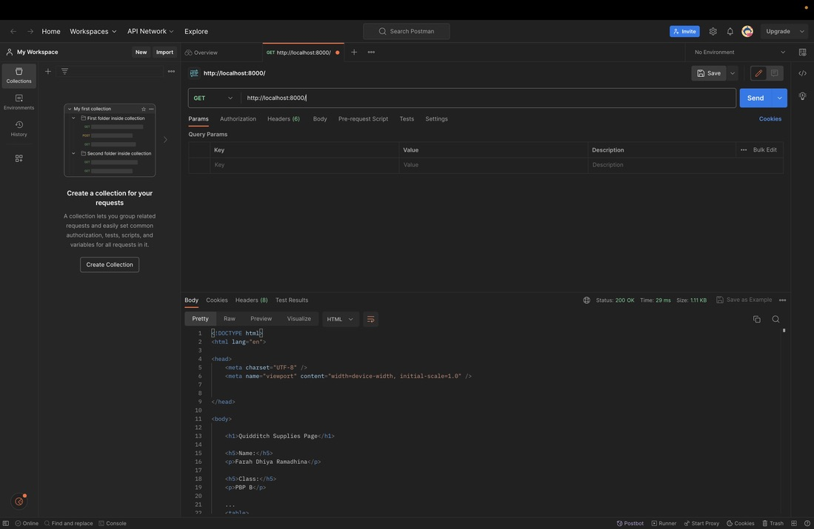
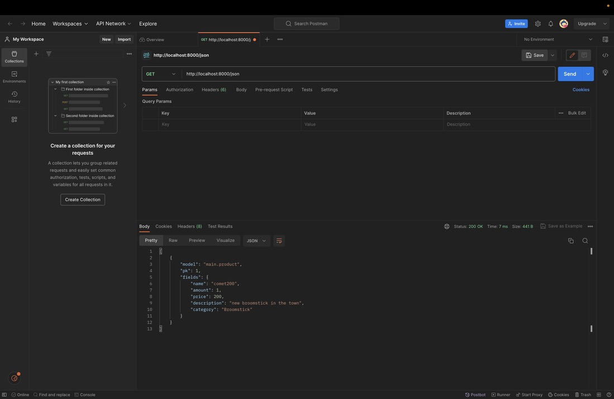
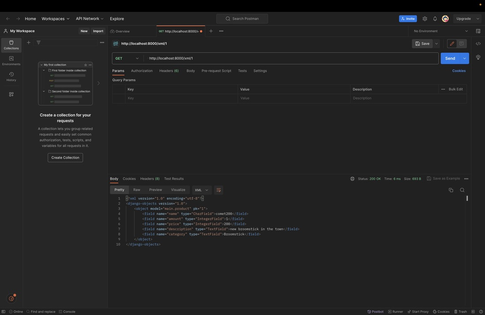
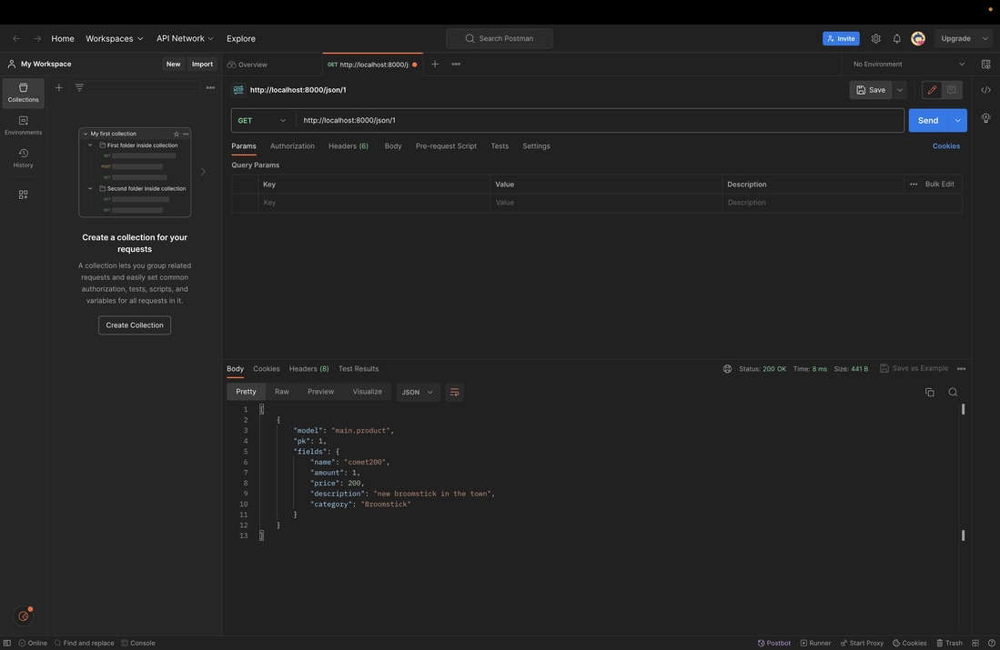

# Tugas 6: JavaScript dan Asynchronous JavaScript #
## Farah Dhiya Ramadhina/PBP B/2206082934 ##

## A. Jelaskan perbedaan antara asynchronous programming dengan synchronous programming. ##
Asynchronous programming dan synchronous programming adalah dua pendekatan yang berbeda dalam menjalankan tugas-tugas dalam sebuah program. Perbedaan utama antara keduanya adalah bagaimana tugas-tugas atau operasi-operasi *non-blocking* (seperti I/O, jaringan, dan pemrosesan yang memakan waktu) dikelola dan dijalankan.

Berikut adalah perbedaan utama antara asynchronous dan synchronous programming:

1. Eksekusi Berurutan (Synchronous):
   - Dalam synchronous programming, tugas-tugas dieksekusi berurutan, satu per satu. Tugas berikutnya harus menunggu tugas sebelumnya selesai sebelum dapat dijalankan.
   - Ini berarti jika ada tugas yang memakan waktu, itu dapat menghentikan eksekusi program secara keseluruhan dan membuat program tampak seperti "terkunci" selama tugas tersebut berjalan.

2. Eksekusi Paralel (Asynchronous):
   - Dalam asynchronous programming, tugas-tugas dapat dijalankan secara paralel tanpa harus menunggu tugas sebelumnya selesai. Tugas yang memakan waktu dapat "ditinggalkan" sementara program menjalankan tugas-tugas lain.
   - Ini memungkinkan program untuk tetap responsif dan tidak terpengaruh oleh tugas yang memakan waktu.

3. Blocking vs. Non-blocking:
   - Dalam synchronous programming, operasi-operasi biasanya blocking, artinya program akan berhenti dan menunggu hasil dari operasi tersebut sebelum melanjutkan eksekusi.
   - Dalam asynchronous programming, operasi-operasi biasanya non-blocking, yang berarti program dapat melanjutkan eksekusi tanpa harus menunggu operasi selesai. Hasil operasi akan ditangani nanti ketika tersedia.

4. Contoh Penggunaan:
   - Synchronous programming cocok untuk tugas-tugas yang bersifat sekuensial dan tidak memakan waktu, seperti perhitungan matematis sederhana.
   - Asynchronous programming lebih sesuai untuk tugas-tugas yang memakan waktu, seperti permintaan HTTP ke server, operasi-disk, atau interaksi jaringan, di mana responsifitas dan kinerja yang baik penting.

5. Callbacks vs. Await/Async:
   - Dalam asynchronous programming, umumnya digunakan pendekatan seperti callback functions (misalnya, dalam JavaScript) atau await/async (seperti dalam Python dengan kata kunci `async` dan `await`) untuk mengelola operasi asynchronous.

Kesimpulannya, asynchronous programming memungkinkan program untuk tetap responsif dan menjalankan tugas-tugas secara paralel, sementara synchronous programming menjalankan tugas-tugas secara berurutan. Pilihan antara keduanya tergantung pada kebutuhan aplikasi dan jenis tugas yang dijalankan dalam program tersebut.

## B. Dalam penerapan JavaScript dan AJAX, terdapat penerapan paradigma event-driven programming. Jelaskan maksud dari paradigma tersebut dan sebutkan salah satu contoh penerapannya pada tugas ini. ##
Paradigma event-driven programming adalah paradigma pemrograman yang berfokus pada ketersediaan dan pengelolaan peristiwa (events) sebagai pusat kendali dalam sebuah program. Dalam paradigma ini, program secara aktif merespons peristiwa atau kejadian yang terjadi, seperti interaksi pengguna *(mouse clicks, keyboard input)*, permintaan jaringan (HTTP requests), dan peristiwa lainnya. Program akan merespons peristiwa-peristiwa ini dengan menjalankan tindakan atau fungsi tertentu yang telah ditentukan sebelumnya. Dengan kata lain, program "mendengarkan" peristiwa-peristiwa dan merespons mereka saat mereka terjadi.

Contoh penerapan paradigma event-driven programming dalam JavaScript dan AJAX adalah:

1. **Handling Mouse Click Event:**
   - Ketika seorang pengguna mengklik sebuah elemen HTML di halaman web, peristiwa mouse click terjadi.
   - Kita dapat menggunakan JavaScript untuk menangani peristiwa ini dengan menambahkan event listener ke elemen HTML yang bersangkutan. Sebagai contoh:
   ```ruby
   // Tambahkan event listener untuk tombol "Delete"
    const deleteButtons = document.querySelectorAll('.delete-product-button');
    deleteButtons.forEach(button => {
        button.addEventListener('click', function () {
            const productId = this.getAttribute('data-product-id');

            // Konfirmasi penghapusan
            if (confirm('Apakah Anda yakin ingin menghapus produk ini?')) {
                deleteProduct(productId);
            }
        });
    });
   ```
   Dalam contoh di atas, ketika elemen HTML dengan ID "deleteButtons" diklik, fungsi yang telah ditentukan akan dijalankan.

2. **AJAX Request and Response Handling:**
   - Dalam penggunaan AJAX (Asynchronous JavaScript and XML), program umumnya akan mengirim permintaan ke server (misalnya, permintaan HTTP GET atau POST) secara asynchronous.
   - Program akan merespons peristiwa yang terkait dengan permintaan AJAX, seperti ketika permintaan selesai atau ketika respons dari server diterima. Ini memungkinkan program untuk menjalankan tindakan berdasarkan hasil permintaan ke server.
   - Berikut adalah contoh penggunaan AJAX dengan paradigma event-driven:
   a. Mengambil Produk (AJAX GET) :
   ```ruby
   async function getProducts() {
        return fetch("").then((res) => res.json());
        }

        async function refreshProducts() {
        document.getElementById("product-table").innerHTML = "abc"; // Menampilkan pesan sementara
        const products = await getProducts();
        let htmlString = ``;
        products.forEach((item) => {
            htmlString += `
            <div class="product-card">
                <!-- Detail produk diisi di sini -->
            </div>`;
        });

        document.getElementById("product-table").innerHTML = htmlString; // Memperbarui tampilan produk
        }
   ```
   Di atas, fungsi refreshProducts digunakan untuk mendapatkan produk dengan memanggil fungsi getProducts secara asynchronous. Setelah permintaan selesai dan respons dari server diterima, produk diperbarui di dalam elemen dengan ID "product-table". Ini adalah contoh penggunaan event-driven, di mana kita menunggu permintaan selesai (ketika respons sudah ada) sebelum memperbarui tampilan produk.

   b. Menambahkan Produk (AJAX POST) : 
   ```ruby
   function addProduct() {
        const formData = new FormData(document.querySelector('#form'));

        fetch("", {
            method: "POST",
            body: formData,
        }).then(refreshProducts);

        document.getElementById("form").reset();
        // document.getElementById("button_add").onclick = addProduct
        }
        document.getElementById("button_add").onclick = addProduct;
    ```
    Di sini, ketika tombol "Add Product by AJAX" ditekan, fungsi addProduct akan dijalankan. Ini akan mengirim data produk baru ke server dengan metode POST dan kemudian memanggil refreshProducts setelah permintaan selesai. Ini juga merupakan contoh penggunaan event-driven, di mana kita menunggu hasil permintaan POST sebelum memperbarui tampilan produk.

Dalam kedua contoh di atas, Anda merespons peristiwa-peristiwa tertentu (penyelesaian permintaan AJAX) untuk menjalankan tindakan tertentu (menampilkan atau memperbarui data produk). Itu adalah contoh dari penggunaan paradigma event-driven dalam penggunaan AJAX di halaman web.

## C. Jelaskan penerapan asynchronous programming pada AJAX. ##
Penerapan asynchronous programming pada AJAX (Asynchronous JavaScript and XML) adalah inti dari cara AJAX berfungsi. AJAX memungkinkan penanganan permintaan (requests) dan respons (responses) ke server dilakukan secara asynchronous, yang berarti kita dapat melakukan tugas lain tanpa harus menunggu respons dari server. Berikut adalah beberapa poin penting dalam penerapan asynchronous programming pada AJAX:

1. **Asynchronous Request Handling:**
   - Dalam asynchronous programming dengan AJAX, ketika kita mengirim permintaan (request) ke server, JavaScript tidak akan menghentikan eksekusi program. Sebaliknya, kode kita akan terus berjalan, dan JavaScript akan menangani permintaan secara latar belakang.
   - Ini sangat berguna dalam menghindari pembekuan antarmuka pengguna (UI freezing) saat menunggu respons dari server. Pengguna dapat tetap berinteraksi dengan halaman web tanpa gangguan.

2. **Event Handling:**
   - Untuk menangani respons dari server, kita menggunakan event listeners yang berkaitan dengan peristiwa-peristiwa tertentu. Biasanya, kita akan menggunakan event "load" untuk menentukan tindakan yang akan diambil ketika respons berhasil diterima.
   - Anda juga dapat menangani peristiwa-peristiwa lain, seperti "error" untuk menangani kesalahan dalam permintaan.

Penerapan asynchronous programming pada AJAX memungkinkan *developer* untuk membuat aplikasi yang responsif dan efisien. Ini memungkinkan pengembangan aplikasi web yang dinamis tanpa harus menunggu respons dari server, yang sangat penting dalam pengembangan modern berbasis web.

## D. Pada PBP kali ini, penerapan AJAX dilakukan dengan menggunakan Fetch API daripada library jQuery. Bandingkanlah kedua teknologi tersebut dan tuliskan pendapat kamu teknologi manakah yang lebih baik untuk digunakan. ##
Penentuan apakah Fetch API atau jQuery lebih baik digunakan dalam pengembangan aplikasi web dengan AJAX tergantung pada kebutuhan dan preferensi proyek yang dikerjakan. Berikut perbandingan antara keduanya serta beberapa pertimbangan yang membantu saya memutuskan mana yang lebih sesuai.

**Fetch API:**
1. **Native:** Fetch API adalah bagian dari standar JavaScript modern (ECMAScript) dan telah didukung oleh hampir semua browser terbaru. Ini berarti kita tidak perlu lagi mengunduh atau memasang library eksternal untuk menggunakannya.

2. **Promise-Based:** Fetch API menggunakan model promise, yang membuat kode asinkron menjadi lebih mudah dibaca dan dikelola. Kita dapat menggunakan `then()` dan `catch()` untuk menangani respons dan kesalahan.

3. **Lebih Ringan:** Fetch API lebih ringan dibandingkan jQuery. Jika kita hanya memerlukan AJAX tanpa kebutuhan fungsi-fungsi tambahan yang disediakan oleh jQuery, Fetch API akan mengurangi overhead.

4. **Modern:** Karena Fetch API adalah bagian dari standar JavaScript modern, pengembang sering merasa lebih nyaman dengan teknologi bawaan browser.

**jQuery:**
1. **Kompatibilitas**: jQuery telah lama digunakan dalam pengembangan web dan menyediakan lapisan abstraksi yang memungkinkan kita menangani perbedaan kompatibilitas antar browser dengan lebih mudah. Ini sangat berguna jika kita perlu mendukung browser lama yang mungkin tidak mendukung Fetch API.

2. **Lebih Mudah:** jQuery memangkas banyak boilerplate code yang diperlukan dalam Fetch API. Kita dapat menulis kode AJAX dengan lebih sedikit baris kode.

3. **Plugin Ekstensif:** jQuery memiliki banyak plugin yang dapat memperluas kemampuan Anda dalam hal animasi, DOM manipulation, dan tugas-tugas umum dalam pengembangan web.

Untuk PBP kali ini, menurut saya penggunaan Fetch API akan menjadi pilihan yang lebih baik. Alasan-alasan utama untuk ini adalah:

- **Modern dan Lebih Ringan** : Fetch API adalah bagian dari standar modern JavaScript, dan memiliki footprint yang lebih kecil dibandingkan dengan jQuery. Dalam proyek-proyek modern, lebih baik menggunakan teknologi yang merupakan bagian dari bahasa JavaScript itu sendiri, daripada mengandalkan library pihak ketiga seperti jQuery. Ini mengurangi overhead unduhan dan pemrosesan yang tidak perlu.
- **Promise-based** : Fetch API menggunakan konsep Promise, yang membuat pengelolaan asynchronous menjadi lebih jelas dan kuat. Ini menghindari callback hell yang dapat muncul dalam penggunaan AJAX dengan jQuery.
- **Fleksibilitas** : Fetch API memberikan kontrol yang lebih besar atas permintaan HTTP dan respons. Anda dapat dengan mudah mengatur header, metode, mode CORS, dan opsi lainnya sesuai kebutuhan Anda.
- **Kode yang Lebih Modern** : Menggunakan Fetch API akan menciptakan kode JavaScript yang lebih modern dan sesuai dengan praktik terbaru dalam pengembangan web. Hal ini mempermudah pemeliharaan dan perluasan kode di masa depan.

Sementara jQuery masih merupakan library yang berguna dan memiliki tempat dalam pengembangan web, penggunaan Fetch API adalah pilihan yang lebih sesuai dalam konteks kode di atas.

## E. Jelaskan bagaimana cara kamu mengimplementasikan checklist di atas secara step-by-step (bukan hanya sekadar mengikuti tutorial). ##
### Mengubah tugas 5 yang telah dibuat sebelumnya menjadi menggunakan AJAX. ###
**AJAX GET**
Ubahlah kode cards data item agar dapat mendukung AJAX GET.
Lakukan pengambilan task menggunakan AJAX GET.
- AJAX GET digunakan untuk memuat produk dari server secara asynchronous. Produk dipanggil melalui URL .
```RUBY
async function getProducts() {
  return fetch("").then((res) => res.json())
}
```
- Fungsi getProducts mengembalikan hasil dari pemanggilan fetch yang meminta data produk dari server.
- URL  adalah URL yang akan mengambil data produk dari server. 

**AJAX POST**
Buatlah sebuah tombol yang membuka sebuah modal dengan form untuk menambahkan item.
(Modal di-trigger dengan menekan suatu tombol pada halaman utama. Saat penambahan item berhasil, modal harus ditutup dan input form harus dibersihkan dari data yang sudah dimasukkan ke dalam form sebelumnya.)
- AJAX POST digunakan untuk menambahkan produk baru ke server menggunakan formulir modal. Formulir ini memiliki atribut onsubmit="return false;" yang menghentikan perilaku default pengiriman formulir.
```RUBY
function addProduct() {
    const formData = new FormData(document.querySelector('#form'));

    fetch("", {
        method: "POST",
        body: formData,
    }).then(refreshProducts)

    document.getElementById("form").reset()
    // document.getElementById("button_add").onclick = addProduct

    return false
}
document.getElementById("button_add").onclick = addProduct
```
- Fungsi addProduct mengambil data formulir menggunakan FormData dan mengirimkannya ke server melalui POST request. Setelah itu, fungsi refreshProducts dipanggil untuk memperbarui tampilan produk.
- URL  adalah URL yang digunakan untuk menambahkan produk baru. 

**CSRF Token**
Terdapat fungsi getCookie yang digunakan untuk mendapatkan token CSRF dari cookie. Token CSRF ini kemudian digunakan dalam permintaan POST untuk keamanan.
```RUBY
function getCookie(name) {
    const cookieValue = document.cookie.match('(^|;)\\s*' + name + '\\s*=\\s*([^;]+)');
    return cookieValue ? cookieValue.pop() : '';
}
```
**AJAX Delet**
Fungsi deleteProduct digunakan untuk menghapus produk dengan metode DELETE dan mengambil token CSRF untuk digunakan dalam permintaan.
```RUBY
async function deleteProduct(productId) {
    try {
        const csrfToken = getCookie('csrftoken');
        const response = await fetch(`/delete_product_ajax/${productId}`, {
            method: 'DELETE',
            headers: {
                'X-CSRFToken': csrfToken,
            },
        });

        if (response.status === 204) {
            refreshProducts();
        } else {
            alert('Gagal menghapus produk.');
        }
    } catch (error) {
        console.error('Error:', error);
    }
}
```
**Event Listener**
Terdapat event listener yang ditambahkan pada tombol "Delete" dengan kelas .delete-product-button. Ini digunakan untuk mengonfirmasi penghapusan produk sebelum menghapusnya.
```ruby
const deleteButtons = document.querySelectorAll('.delete-product-button');
deleteButtons.forEach(button => {
    button.addEventListener('click', function () {
        const productId = this.getAttribute('data-product-id');

        // Konfirmasi penghapusan
        if (confirm('Apakah Anda yakin ingin menghapus produk ini?')) {
            deleteProduct(productId);
        }
    });
});
```
Fungsi ini menjalankan deleteProduct saat tombol "Delete" ditekan dan menampilkan dialog konfirmasi sebelum penghapusan produk.

### Buatlah fungsi view baru untuk menambahkan item baru ke dalam basis data. ###
Fungsi `create_ajax` bertujuan untuk menambahkan item baru ke dalam basis data. Fungsi ini digunakan untuk menerima permintaan AJAX POST yang mengirimkan data produk baru dari sisi klien ke server.Berikut langkah-langkahnya : 
- **Pemeriksaan Metode dan Data** : Pertama-tama, fungsi ini memeriksa jika metode HTTP yang digunakan adalah POST. Ini memastikan bahwa fungsi ini hanya berjalan saat ada permintaan POST.
- **Menerima Data Produk** : Data produk yang dikirim oleh klien diterima melalui permintaan POST. Data ini mencakup informasi seperti nama, jumlah, harga, deskripsi, kategori, dan gambar produk. Data ini diambil dari request.POST.
- **Membuat Objek Produk Baru** : Dari data yang diterima, fungsi ini membuat objek Product baru yang akan ditambahkan ke basis data. Objek ini mencakup semua detail produk, termasuk pemilik (pengguna yang saat ini masuk).
- **Menyimpan Produk Baru** : Setelah objek produk baru dibuat, fungsi ini menyimpannya ke basis data dengan memanggil metode save().
- **Mengirim Respon** : Jika semua operasi berhasil, fungsi ini mengirimkan respons HTTP dengan kode status 201 (Created). Ini menunjukkan bahwa item baru telah berhasil ditambahkan ke basis data. Respon ini dapat digunakan oleh klien untuk menanggapi operasi tambah produk.

Jadi, dalam langkah ini, fungsi `create_ajax` melakukan penerimaan, validasi, pembuatan objek produk baru, penyimpanan, dan mengirimkan respon ke sisi klien untuk menambahkan produk ke basis data melalui permintaan AJAX.

### Buatlah path /create-ajax/ yang mengarah ke fungsi view yang baru kamu buat dan Hubungkan form yang telah kamu buat di dalam modal kamu ke path /create-ajax/. ###
Untuk membuat path `/create-ajax/` dan menghubungkan form di dalam modal dengan path tersebut, saya telah menambahkan kode JavaScript yang berfungsi untuk mengirim data form ke path `/create-ajax/` saat tombol "Add Product by AJAX" ditekan. Berikut adalah penjelasan langkah-langkahnya:

1. **Kode JavaScript**:
   - Di dalam JavaScript, terdapat dua fungsi penting: `addProduct` dan `deleteProduct`.
   - Fungsi `addProduct` mengirimkan data form ke server dengan menggunakan metode `POST` dan mengisi form dengan data yang dimasukkan oleh pengguna di dalam modal. Ini akan memicu fungsi view `create_ajax` ketika data dikirim.
   - Fungsi `deleteProduct` digunakan untuk menghapus produk dengan metode `DELETE`. Ini memerlukan pengiriman token CSRF yang diambil dari cookie untuk otorisasi.
   - Terdapat penggunaan `fetch` untuk mengirim permintaan HTTP (POST dan DELETE) ke server.

2. **Kode HTML Modal**:
   - Di dalam modal, saat tombol "Add Product by AJAX" ditekan (`<button type="button" class="btn btn-primary" id="button_add" data-bs-dismiss="modal">Add Product by AJAX</button>`), fungsi `addProduct` dipanggil, yang kemudian mengambil data dari form, mengirimnya ke server, dan memperbarui tampilan produk.

3. **Penambahan Event Listener**:
   - Terdapat event listener untuk tombol "Delete" (`<button class="delete-product-button" onClick="deleteProduct(${item.pk})">Delete by AJAX</button>`) yang mengaktifkan fungsi `deleteProduct` ketika tombol "Delete by AJAX" ditekan. Ini memungkinkan penghapusan produk dengan menggunakan metode `DELETE`.

4. **Konfirmasi Penghapusan**:
   - Ketika tombol "Delete by AJAX" ditekan, ada konfirmasi yang muncul (`if (confirm('Apakah Anda yakin ingin menghapus produk ini?'))`) untuk memastikan pengguna yakin sebelum menghapus produk. Jika konfirmasi diterima, fungsi `deleteProduct` akan dijalankan.

5. **Pembaruan Tampilan Produk**:
   - Setelah pengiriman data atau penghapusan berhasil, tampilan produk diperbarui dengan memanggil `refreshProducts` yang mengambil data produk dengan menggunakan `fetch` dan menggantikan tampilan produk saat ini dengan yang baru.

Jadi, dengan menggunakan kode JavaScript ini, saya telah membuat path `/create-ajax/` terhubung dengan form di dalam modal, dan saya juga telah mengimplementasikan pengiriman data form melalui AJAX serta penghapusan produk dengan metode AJAX.


# Tugas 5: Desain Web menggunakan HTML, CSS dan Framework CSS #
## Farah Dhiya Ramadhina/PBP B/2206082934 ##

## A. Jelaskan manfaat dari setiap element selector dan kapan waktu yang tepat untuk menggunakannya.
**Selector Universal (*)**
 Digunakan untuk memilih semua elemen di halaman. Sebaiknya digunakan dengan hati-hati karena dapat memengaruhi semua elemen. Waktu yang tepat untuk menggunakannya adalah saat kita ingin memberikan gaya umum untuk semua elemen, misalnya mengatur padding atau margin secara umum.

**Selector Tipe (element)**
 Digunakan untuk memilih semua elemen dengan jenis tertentu, seperti p untuk paragraf atau h1 untuk judul level 1. Waktu yang tepat untuk menggunakannya adalah saat kita ingin memberikan gaya khusus untuk suatu jenis elemen tertentu di seluruh halaman.

**Selector ID (#id)**
 Digunakan untuk memilih elemen dengan atribut id tertentu, yang seharusnya unik dalam satu halaman. Waktu yang tepat untuk menggunakannya adalah saat kita ingin memberikan gaya khusus untuk satu elemen tertentu yang memiliki ID tertentu.

**Selector Kelas (.class)**
 Digunakan untuk memilih elemen-elemen dengan kelas tertentu. Ini memungkinkan Anda memberikan gaya yang sama kepada beberapa elemen. Waktu yang tepat untuk menggunakannya adalah saat kita ingin membagi beberapa elemen menjadi kelompok dengan gaya yang sama.

## B. Jelaskan HTML5 Tag yang kamu ketahui.
Berikut HTML5 Tag yang umum yang saya tau :
`<header>` : Digunakan untuk mengelompokkan elemen-elemen yang berada di bagian atas halaman, seperti judul, logo, dan menu navigasi.
`<nav>` : Menandakan bagian yang berisi tautan navigasi, seperti navbar.
`<section>` : Mengelompokkan konten yang memiliki tema atau topik yang sama dalam sebuah halaman.
`<footer>` : Digunakan untuk mengelompokkan informasi terkait penulis, hak cipta, atau informasi kontak yang biasanya berada di bagian bawah halaman.
 
## C. Jelaskan perbedaan antara margin dan padding.
 **Margin**
 Margin adalah ruang di luar batas elemen. Margin memengaruhi jarak antara elemen dengan elemen-elemen lain di sekitarnya. Margin tidak memiliki latar belakang atau warna. 
 
 **Padding**
 Padding adalah ruang di dalam batas elemen, antara isi elemen dan batasnya. Padding memengaruhi jarak antara isi elemen dan batasnya. Kita dapat memberikan latar belakang atau warna pada padding.

## D. Jelaskan perbedaan antara framework CSS Tailwind dan Bootstrap. Kapan sebaiknya kita menggunakan Bootstrap daripada Tailwind, dan sebaliknya?
 **Tailwind CSS** 
 Tailwind adalah framework CSS yang memberikan banyak kelas utilitas yang dapat digunakan langsung dalam HTML untuk mengatur tampilan elemen. Kelebihan Tailwind adalah fleksibilitas yang tinggi dan memungkinkan kita untuk mengkustomisasi tampilan dengan detail tinggi. Tailwind cocok jika kita ingin membuat desain yang sangat khusus.

 **Bootstrap**
 Bootstrap adalah framework CSS yang menyediakan komponen UI yang siap pakai seperti tombol, formulir, dan navigasi. Bootstrap memiliki desain yang telah dirancang dengan baik dan dapat mempercepat pengembangan web. Sebaiknya digunakan jika Anda ingin membuat situs dengan desain yang konsisten dan cepat.

**Kapan Menggunakan Bootstrap atau Tailwind:**
- Gunakan Bootstrap jika kita ingin membuat *web* dengan desain yang cepat dan konsisten tanpa perlu banyak kustomisasi.
- Gunakan Tailwind jika kita ingin memiliki tingkat kustomisasi yang tinggi dan memiliki kendali penuh atas tampilan elemen-elemen di halaman web Anda. Tailwind cocok untuk proyek yang membutuhkan desain yang sangat unik.

## E. Implementasi Checklist *step-by-step*.
### Kustomisasi desain pada templat HTML yang telah dibuat pada Tugas 4 dengan menggunakan CSS atau CSS framework (seperti Bootstrap, Tailwind, Bulma) dengan ketentuan sebagai berikut ###
Untuk mengkustomisasi website saya, saya menggunakan CSS dan CSS Framework yaitu Bootstrap pada navbar di main page. Saya menggunakan Title dan Inline CSS Style untuk mengkustomisasi tampilan web saya. Dapat dilihat bahwa saya menggunakan blok `<style>` untuk menentukan *style* CSS yang akan digunakan secara lokal

#### 1. Kustomisasi halaman login, register, dan tambah inventori semenarik mungkin. ####
**Login Page**
- h1 dan p yang mengatur tulisan `Login` dan tulisan  lain pada page saya set dengan font "Poppins" 
- Background Image saya kustomisasi dengan gambar yg saya ambil sendiri di internet dan saya letakan di folder media, sehingga pada layout login saya refer ke URL '/media/hogsmeade.jpeg' pada class login dan saya atur properti seperti background-size dan background-position agar sesuai. Tidak lupa saya juga membuat class image dan mengatur efek blur pada background image.
- Layout halaman login saya atur dengan membuat sebuah div dengan class "login". Kemudian, div dengan class "wrapper" digunakan untuk mengatur *floating card* login yang akan ditampilkan pada tengah layar.
 1. `.login` adalah selektor untuk elemen dengan class "login", yang mengatur tampilan elemen tersebut.
   - `display: flex;`: Menggunakan flexbox untuk mengatur layout.
   - `flex-direction: column;`: Mengatur arah flexbox menjadi kolom.
   - `align-items: center;`: Mengatur agar elemen secara horizontal berada di tengah.
   - `justify-content: center;`: Mengatur agar elemen secara vertikal berada di tengah.
   - `height: 100vh;`: Mengatur tinggi elemen menjadi 100% dari tinggi viewport.
   - `background-image: url('/media/hogsmeade.jpeg');`: Menetapkan gambar latar belakang.
   - `background-size: cover;`: Mengatur agar gambar latar belakang mencakup seluruh elemen.
   - `background-position: center;`: Mengatur posisi latar belakang ke tengah.

2. `.image`: Ini adalah selektor untuk elemen dengan class "image", yang mengatur tampilan gambar latar belakang.
   - `filter: blur(2px);`: Menggunakan efek blur pada gambar.
   - `height: 100%; width: 100%;`: Mengatur gambar agar mengisi seluruh elemen.

3. `.wrapper`: Ini adalah selektor untuk elemen dengan class "wrapper", yang mengatur tampilan card login.
   - `width: 380px;`: Mengatur lebar elemen.
   - `background: #fff;`: Memberikan latar belakang putih.
   - `border-radius: 15px;`: Mengatur sudut elemen menjadi bundar.
   - `box-shadow: 0px 15px 20px rgba(0,0,0,0.1);`: Menambahkan bayangan elemen.
   - `text-align: center;`: Mengatur teks menjadi terpusat.

4. `.wrapper h1`: Ini adalah selektor untuk elemen h1 dalam ".wrapper", yang mengatur tampilan judul "Login".
   - `font-size: 35px;`: Mengatur ukuran font.
   - `font-weight: 600;`: Mengatur ketebalan font.
   - `line-height: 100px;`: Mengatur tinggi baris.
   - `color: #fff;`: Mengatur warna teks.
   - `background: linear-gradient(-135deg, #c2f4e3, #76e6c1);`: Memberikan latar belakang dengan gradient linear.
   - `border-radius: 15px 15px 0 0;`: Mengatur sudut latar belakang.

5. `.wrapper form`: Ini adalah selektor untuk elemen form dalam ".wrapper", yang mengatur padding dan margin dalam form.

6. `.signup-link`: Selektor untuk elemen dengan class "signup-link", yang mengatur margin atas dan bawah.

7. `.field` : Ini adalah selektor untuk elemen dengan class "field", yang mengatur sudut elemen menjadi bundar.

- Jika ada pesan informasi (misalnya, pesan kesalahan login), pesan tersebut akan ditampilkan dalam daftar. Saya menggunakan elemen ul dan li untuk tampilan pesan yang lebih baik.
1. `.wrapper ul li`: Ini adalah selektor untuk elemen daftar dalam ".wrapper", yang mengatur font, ukuran, dan warna teks.

2. `.message-info`: Ini adalah selektor untuk pesan informasi di bawah username dan password. Anda mengatur font, ukuran, dan warna teks.

- Tombol Login dan Register: Anda mengkustomisasi tombol login dengan warna latar belakang #76E6C1, font berwarna #4B1A17, dan efek bayangan. Tombol "Register Now" juga ditambahkan untuk mengarahkan ke halaman registrasi jika pengguna belum memiliki akun, tombol register memiliki efek hover yang mengubah latar belakang saat kursor mengarah ke tombol.

1. `.login_btn` dan `.register_btn`: Ini adalah selektor untuk tombol login dan register. Anda mengatur padding, warna latar belakang, warna teks, dan lain-lain.

2. `.register_btn:hover`: Ini adalah efek yang akan aktif saat kursor mengarah ke tombol register. Anda mengubah warna latar belakang, warna border, dan warna teks saat tombol dihover.

**Register Page**
- h1 dan p yang mengatur tulisan `Register` dan tulisan lain pada page saya set dengan font "Poppins" 
- Background Image saya kustomisasi dengan gambar yg saya ambil sendiri di internet dan saya letakan di folder media, sehingga pada layout login saya refer ke URL '/media/hogsmeade.jpeg' pada class login dan saya atur properti seperti background-size dan background-position agar sesuai. Tidak lupa saya juga membuat class image dan mengatur efek blur pada background image.
- Layout halaman register saya atur dengan membuat sebuah div dengan class "register". Kemudian, div dengan class "wrapper" digunakan untuk mengatur *floating card* register yang akan ditampilkan pada tengah layar.
1. `.register` adalah selektor untuk elemen dengan class "register", yang mengatur tampilan elemen tersebut.
   - `display: flex;`: Menggunakan flexbox untuk mengatur layout.
   - `flex-direction: column;`: Mengatur arah flexbox menjadi kolom.
   - `align-items: center;`: Mengatur agar elemen secara horizontal berada di tengah.
   - `justify-content: center;`: Mengatur agar elemen secara vertikal berada di tengah.
   - `height: 100vh;`: Mengatur tinggi elemen menjadi 100% dari tinggi viewport.
   - `background-image: url('/media/hogsmeade.jpeg');`: Menetapkan gambar latar belakang.
   - `background-size: cover;`: Mengatur agar gambar latar belakang mencakup seluruh elemen.
   - `background-position: center;`: Mengatur posisi latar belakang ke tengah.

2. `.image`: Ini adalah selektor untuk elemen dengan class "image", yang mengatur tampilan gambar latar belakang.
   - `filter: blur(2px);`: Menggunakan efek blur pada gambar.
   - `height: 100%; width: 100%;`: Mengatur gambar agar mengisi seluruh elemen.

3. `.wrapper`: Ini adalah selektor untuk elemen dengan class "wrapper", yang mengatur tampilan card login.
   - `width: 380px;`: Mengatur lebar elemen.
   - `background: #fff;`: Memberikan latar belakang putih.
   - `border-radius: 15px;`: Mengatur sudut elemen menjadi bundar.
   - `box-shadow: 0px 15px 20px rgba(0,0,0,0.1);`: Menambahkan bayangan elemen.
   - `text-align: center;`: Mengatur teks menjadi terpusat.

4. `.wrapper h1`: Ini adalah selektor untuk elemen h1 dalam ".wrapper", yang mengatur tampilan judul "Login".
   - `font-size: 35px;`: Mengatur ukuran font.
   - `font-weight: 600;`: Mengatur ketebalan font.
   - `line-height: 100px;`: Mengatur tinggi baris.
   - `color: #fff;`: Mengatur warna teks.
   - `background: linear-gradient(-135deg, #c2f4e3, #76e6c1);`: Memberikan latar belakang dengan gradient linear.
   - `border-radius: 15px 15px 0 0;`: Mengatur sudut latar belakang.

5. `.wrapper form`: Ini adalah selektor untuk elemen form dalam ".wrapper", yang mengatur padding dan margin dalam form.

- Tombol Register
1. `.button_submit` : Ini adalah selektor CSS yang digunakan untuk mengkustomisasi tampilan elemen yang memiliki class "button_submit".
- display: flex;: Mengatur elemen dengan class "button_submit" agar mengikuti model tata letak "flex", yang berguna untuk mengatur tampilan secara fleksibel.
- flex-direction: column;: Mengatur arah tata letak elemen menjadi kolom, yang akan membuat elemen-elemen dalam container diatur secara vertikal.
- align-items: center;: Mengatur elemen-elemen dalam container agar berada di tengah secara horizontal.

2. `daftar_btn` : Ini adalah selector CSS yang digunakan untuk mengkustomisasi tampilan tombol "Daftar" yang memiliki class "daftar_btn".
- padding: 10px 25px;: Mengatur jarak antara teks dan batasan tombol, baik dari atas/bawah (10px) maupun dari kiri/kanan (25px).
- background-color: #76E6C1;: Mengatur warna latar belakang tombol menjadi hijau (#76E6C1).
- border: none;: Menghilangkan border tombol.
- color: #4B1A17;: Mengatur warna teks tombol menjadi coklat (#4B1A17).
- text-align: center;: Mengatur teks tombol agar berada di tengah secara horizontal.
- font-family: 'Poppins', sans-serif;: Mengatur font teks tombol.
- font-size: 15px;: Mengatur ukuran font menjadi 15px.
- font-style: normal;: Mengatur gaya font menjadi normal.
- font-weight: 500;: Mengatur ketebalan font menjadi 500.
- line-height: normal;: Mengatur tinggi baris font menjadi normal.
- cursor: pointer;: Mengubah ikon kursor saat mengarah ke tombol menjadi tanda tangan (tanda tangan tindakan klik).
- margin-top: 20px; margin-bottom: 10px;: Mengatur jarak antara tombol dan elemen-elemen di atas dan di bawahnya.
- box-shadow: 0px 4px 6px rgba(0, 0, 0, 0.1);: Menambahkan bayangan (shadow) pada tombol untuk memberikan efek tiga dimensi. Bayangan ini akan muncul saat tombol diberikan interaksi.
- border-radius: 15px;: Mengatur sudut border tombol menjadi membulat, menciptakan tampilan sudut yang lebih lembut.

Struktur HTML:
Tombol "Daftar" ini ditempatkan di dalam elemen dengan class "button_submit", yang sebelumnya telah dikustomisasi dalam CSS dengan tampilan flex.

- Pesan informasi seperti keteraangan *requirement*, pesan tersebut akan ditampilkan dalam daftar. Saya menggunakan elemen ul dan li untuk tampilan pesan yang lebih baik.
1. `.wrapper ul li`: Ini adalah selektor untuk elemen daftar dalam ".wrapper", yang mengatur font, ukuran, dan warna teks.

2. `.message-info`: Ini adalah selektor untuk pesan informasi di bawah username dan password. Anda mengatur font, ukuran, dan warna teks.

**Create Product Page**
1. `.create` adalah class untuk kontainer utama halaman "create". Ini mengatur konten agar berada di tengah vertikal dan horizontal, mengatur background dengan image, dan lainnya.
2. `.create-card` adalah class untuk kartu yang berisi form ""Add New Product". Ini mengatur tampilan kartu seperti *background color*, bayangan (shadow), lebar, dan lainnya.
3. `.create-card h1` digunakan untuk mengkustomisasi judul kartu. Ini mengatur tampilan judul kartu seperti warna teks, latar belakang gradient, dan lainnya.
4. `.create-card form` digunakan untuk mengatur tampilan formulir dalam kartu, termasuk padding.
5. `.input-field` digunakan untuk mengkustomisasi tampilan input field dalam formulir seperti padding, border, dan lainnya.
6. `#id_category` digunakan Khusus mengkustomisasi input field dengan id "id_category", mengurangi ukuran input dengan size: smaller.
7. `.submit-button` digunakan untuk mengkustomisasi tombol "Create Product", termasuk padding, warna latar belakang, border, warna teks, dan bayangan.

Struktur HTML:
Kode HTML ini mencakup elemen-elemen yang akan ditampilkan dalam halaman, seperti judul "Add New Product", formulir untuk menambahkan produk, dan tombol "Create Product". Semua elemen ini diberi class atau atribut sesuai dengan pengaturan gaya CSS yang telah ditentukan sebelumnya.

#### 2. Kustomisasi halaman daftar inventori menjadi lebih berwarna maupun menggunakan approach lain seperti menggunakan Card. ####
1. Untuk navbar, saya menggunakan template bootstrap dari internet, lalu saya kustomisasi untuk judul page yg akan ditampilkan di Navbar dan mengkustomisasi background dan style lainnya pada navbar
2. Saya mengatur latar belakang halaman dengan empat gradient linear yang berbeda. Ini menciptakan latar belakang berwarna-warni dengan efek "gradien". Gradien-gradien ini ditempatkan di berbagai sudut.
3. Saya mengatur styling untuk app-name seperti font, sie, position, margin, line-weight untuk ketebalan, dan lain-lain 
4. **Implementasi Produk Cards**
`.product-cards` adalah kelas yang digunakan untuk mengelompokkan dan mengatur kartu produk. 
- display: flex; digunakan untuk mengatur produk secara horizontal, dan 
- flex-wrap: wrap; memungkinkan produk untuk melompat ke baris berikutnya jika ruang terbatas. 
- justify-content: center; mengatur agar produk berada di tengah secara horizontal
- gap: 40px; memberikan jarak antara setiap kartu produk.
`.product-card` adalah kelas yang digunakan untuk menggambarkan tampilan individu dari setiap kartu produk.
- width: calc(23% - 20px); mengatur lebar kartu produk sehingga ada empat kartu dalam satu baris dan ada jarak antara kartu. Ini membuat tampilan produk lebih rapi.
- border-radius: 20px; memberikan sudut melengkung pada kartu produk.
- background: radial-gradient(70.26% 70.26% at 50.11% 50.09%, #FFDAEA 9.38%, #A8E7D0 100%); adalah gaya latar belakang yang menciptakan efek gradien radial dengan dua warna yang berbeda pada setiap kartu.
- margin-top dan margin-bottom digunakan untuk memberikan jarak antara kartu produk.
- padding: 20px; memberikan jarak antara isi dalam kartu dengan tepi kartu.
- box-shadow: 0 0 10px rgba(0, 0, 0, 0.2); menambahkan bayangan lembut ke kartu produk.
- display: flex; flex-direction: column; justify-content: space-between; mengatur isi kartu produk agar ditampilkan secara vertikal dan memiliki ruang di antara elemen-elemennya.
5. `.image-container` dan `.image` adalah selektor untuk elemen dengan class "image-container" dan "image" yang mengatur gambar yg saya letakkan dfi header page dibawah navbar. Saya bedakan image dan image-cvontainer, karena saya set image saya untuk blur namun tidak ingin seluruh elemen yg ada pada header tersebut (terutama app-name) menjadi blur, sehingga saya buat class untuk image dan styling imagenya saja
6. h3, h4, dan h5 saya atur font nya, size nya, margin nya, dan lain-lain.
7. Product-category juga saya styling dan saya letkkan di bagian atas product card
8. Tombol Product amount, edit, dan delete product juga saya styling dengan CSS agar lebih cantik dan rapi

# Tugas 4: Implementasi Autentikasi, Session, dan Cookies pada Django #
## Farah Dhiya Ramadhina/PBP B/2206082934 ##

## A. Apa itu Django UserCreationForm, dan jelaskan apa kelebihan dan kekurangannya? ##
Django `UserCreationForm` adalah salah satu komponen dari kerangka kerja Django yang digunakan untuk **membuat form pendaftaran *user* dalam aplikasi web.** Kelebihan dari `UserCreationForm` adalah **kemudahannya dalam menghasilkan form pendaftaran *user* yang lengkap dengan validasi bawaan**, sehingga *developer* dapat menghemat waktu dalam mengimplementasikan fitur pendaftaran. Form ini juga terintegrasi dengan Django's authentication system, sehingga *user* yang terdaftar dapat dengan mudah masuk ke aplikasi. Kekurangan dari `UserCreationForm` adalah **kurangnya fleksibilitas dalam desain tampilan form**, sehingga mungkin diperlukan kustomisasi tambahan untuk mencocokkan tampilan dengan desain aplikasi yang spesifik.

## B. Apa perbedaan antara autentikasi dan otorisasi dalam konteks Django, dan mengapa keduanya penting? ##
Autentikasi dan otorisasi adalah dua konsep penting dalam pengembangan aplikasi web dengan Django. 

**Autentikasi** adalah proses memeriksa identitas *user* yang mencoba mengakses sistem, biasanya dengan menggunakan *username* dan *password* 

**Otorisasi** adalah proses mengendalikan akses *user* terhadap sumber daya atau tindakan tertentu dalam aplikasi, seperti apakah mereka memiliki izin untuk melihat halaman tertentu atau melakukan tindakan tertentu.

Keduanya penting karena autentikasi memastikan bahwa *user* yang masuk adalah mereka yang mengklaim menjadi diri mereka sendiri, sementara otorisasi memastikan bahwa *user* hanya memiliki akses ke bagian aplikasi yang sesuai dengan peran dan izin mereka. Dengan kata lain, autentikasi menangani "siapa," sedangkan otorisasi menangani "apa yang diizinkan."

## C. Apa itu *cookies* dalam konteks aplikasi web, dan bagaimana Django menggunakan cookies untuk mengelola data sesi pengguna? ##
***Cookies*** adalah file kecil yang disimpan di komputer *user* oleh server web dan digunakan untuk menyimpan informasi sesi atau data lainnya dalam konteks aplikasi web. Django menggunakan *cookies* untuk mengelola data sesi *user* dengan cara menyimpan ID sesi *user* di *cookie*. Ketika *user* melakukan permintaan ke server, server dapat mengidentifikasi pengguna berdasarkan ID sesi yang ada di *cookie* dan mengembalikan data sesi yang sesuai.

## D. Apakah penggunaan *cookies* aman secara *default* dalam pengembangan web, atau apakah ada risiko potensial yang harus diwaspadai? ##
Secara *default*, penggunaan *cookies* dalam pengembangan web tidak selalu aman. Ada beberapa risiko yang harus diwaspadai, seperti:

   - **Cross-Site Scripting (XSS):** Jika aplikasi web rentan terhadap serangan `XSS`, *attacker* dapat mencuri atau memanipulasi data dalam *cookies* pengguna.

   - **Session Hijacking:** Jika sesi *user* dapat diakses oleh *attacker*, mereka dapat mencuri ID sesi dan mengakses akun *user* tanpa izin.

   - **Data Sensitif:** Menyimpan data sensitif seperti kata sandi atau informasi pribadi dalam *cookies* dapat menjadi risiko jika *cookies* dicuri.

Untuk meningkatkan keamanan, penting untuk mengimplementasikan praktik-praktik keamanan seperti **enkripsi data dalam *cookies*, penggunaan `HttpOnly` dan `Secure flags`, serta perlindungan terhadap `XSS`**. Django memiliki alat dan praktik yang direkomendasikan untuk mengelola *cookies* dengan aman, dan penting untuk mengikuti pedoman keamanan yang disediakan oleh Django dalam menggunakannya.

## E. Implementasi Checklist *step-by-step*. ##
### Mengimplementasikan fungsi registrasi, login, dan logout untuk memungkinkan pengguna untuk mengakses aplikasi sebelumnya dengan lancar. ###
* Mengaktifkan virtual environment dengan menjalankan *prompt* berikut pada terminal direktori aplikasi kita `source env/bin/activate`.
* Buka `views.py` yang ada pada `main` dan tambahkan import `redirect`, `UserCreationForm`, dan `messages`
* Buat fungsi `register` seperti berikut yg menerima parameter `request`
```ruby
from django.shortcuts import redirect
from django.contrib.auth.forms import UserCreationForm
from django.contrib import messages  

def register(request):
    form = UserCreationForm()

    if request.method == "POST":
        form = UserCreationForm(request.POST)
        if form.is_valid():
            form.save()
            messages.success(request, 'Your account has been successfully created!')
            return redirect('main:login')
    context = {'form':form}
    return render(request, 'register.html', context)
```
* Buat file HTML baru bernama `register.html` pada folder `main/templates` dan isi file dengan kode berikut :
```ruby



    <title>Register</title>


  

<div class = "login">
    
    <h1>Register</h1>  

        <form method="POST" >  
              
            <table>  
                {{ form.as_table }}  
                <tr>  
                    <td></td>
                    <td><input type="submit" name="submit" value="Daftar"/></td>  
                </tr>  
            </table>  
        </form>

      
        <ul>   
              
                <li>{{ message }}</li>  
                  
        </ul>   
    

</div>  


```
* Buka file `urls.py` pada `main` dan import fungsi yg telah kita buat 
```ruby
from main.views import register
```
* Tambah *path url* dalam `urlpatterns` ubtuk mengakses fungsi yg telah diimport sebelumnya
```ruby
...
path('register/', register, name='register'), 
```

**Fungsi Login**
* Buka `views.py` yang ada pada `main` dan tambahkan import `authenticate` dan `login`
* Buat fungsi `login_user` seperti berikut yg menerima parameter `request`
```ruby
def login_user(request):
    if request.method == 'POST':
        username = request.POST.get('username')
        password = request.POST.get('password')
        user = authenticate(request, username=username, password=password)
        if user is not None:
            login(request, user)
            return redirect('main:show_main')
        else:
            messages.info(request, 'Sorry, incorrect username or password. Please try again.')
    context = {}
    return render(request, 'login.html', context)
```
* Buat file HTML baru bernama `login.html` pada folder `main/templates` dan isi file dengan kode berikut :
```ruby



    <title>Login</title>




<div class = "login">

    <h1>Login</h1>

    <form method="POST" action="">
        
        <table>
            <tr>
                <td>Username: </td>
                <td><input type="text" name="username" placeholder="Username" class="form-control"></td>
            </tr>
                    
            <tr>
                <td>Password: </td>
                <td><input type="password" name="password" placeholder="Password" class="form-control"></td>
            </tr>

            <tr>
                <td></td>
                <td><input class="btn login_btn" type="submit" value="Login"></td>
            </tr>
        </table>
    </form>

    
        <ul>
            
                <li>{{ message }}</li>
            
        </ul>
         
        
    Don't have an account yet? <a href="">Register Now</a>

</div>


```
* Buka file `urls.py` pada `main` dan import fungsi yg telah kita buat 
```ruby
from main.views import login_user
```
* Tambah *path url* dalam `urlpatterns` ubtuk mengakses fungsi yg telah diimport sebelumnya
```ruby
...
path('login/', login_user, name='login'), 
```

**Fungsi Logout**
* Buka `views.py` yang ada pada `main` dan buat fungsi bernama `logout_user` seperti berikut yg menerima parameter `request` serta tambahkan import `logout`
```ruby
from django.contrib.auth import logout

def logout_user(request):
    logout(request)
    return redirect('main:login')
```
* Buka `main.html` pada folder `main/templates` dan tambahkan potongan kode berikut setelah *hyperlink tag* untuk *Add New Product*:
```ruby
...
<a href="">
    <button>
        Logout
    </button>
</a>
...
```
* Buka file `urls.py` pada `main` dan import fungsi yg telah kita buat 
```ruby
from main.views import logout_user
```
* Tambah *path url* dalam `urlpatterns` ubtuk mengakses fungsi yg telah diimport sebelumnya
```ruby
...
path('logout/', logout_user, name='logout'),
```

### Membuat **dua** akun pengguna dengan masing-masing **tiga** *dummy* data menggunakan model yang telah dibuat pada aplikasi sebelumnya untuk setiap akun **di lokal.** ###
* Setelah virtual environment dijalankan, nyalakan server dengan megetik *prompt* ini pada terminal yang sudah di *change directory* pada file yg akan kita jalankan : `python manage.py runserver`
* Jalankan proyek Django dengan membuka http://localhost:8000/  pada browser
* Buat akun pertama dengan mengisi username dan password yang diinginkan, lalu tambahkan 3 data produk baru pada fitur *Add New Product*. Setelah tampilan ketiga produk yang telah ditambahkan muncul, *Logout* akun user pertama.
* Buat akun kedua dengan mengisi username dan password berbeda sesuai keinginan, lalu lakukan kembali langkah-langkah yang ada di poin sebelumnya.
* Kamu telah berhasil membuat 2 akun *user* yang berbeda yg diasosiasikan dengan 3 data produk berbeda per *User*

### Menghubungkan model `Item` dengan `User`. ###
* Buka file `models.py` pada `main` dan tambahkan kode berikut untuk mengimport model : 
```ruby
...
from django.contrib.auth.models import User
...
```
* Pada model `Product` yang telah dibuat, tambahkan kode berikut : 
```ruby
class Product(models.Model):
    user = models.ForeignKey(User, on_delete=models.CASCADE)
    ...
```
potongan kode diatas berguna untuk menghubungkan satu produk dengan satu user melalui *relationship* di mana sebuah produk akan diasosiasikan dengan seorang user
* Buka file `views.py` pada `main` dan ubah potongan kode pada fungsi `create_product` menjadi seperti berikut : 
```ruby
def create_product(request):
 form = ProductForm(request.POST or None)

 if form.is_valid() and request.method == "POST":
     product = form.save(commit=False)
     product.user = request.user
     product.save()
     return HttpResponseRedirect(reverse('main:show_main'))
 ...
 ```
* Ubah fungsi `show_main` menjadi seperti berikut : 
```ruby
def show_main(request):
    products = Product.objects.filter(user=request.user)

    context = {
        'name': request.user.username,
    ...
...
```
* Simpan semua perubahan dan lakukan migrasi model dengan *prompt* `python manage.py makemigrations`
* Saat muncul error saat migrasi model, Ketik 1 untuk menetapkan *default value* untuk f*ield user* pada semua *row* yang telah dibuat pada basis data.
* Ketik angka 1 lagi untuk menetapkan user dengan ID 1 (yang sudah kita buat sebelumnya) pada model yang sudah ada.
* Buka kembali terminal untuk mengaplikasikan migrasi yang telah dilakukan dengan *prompt* : `python manage.py migrate`

### Menampilkan detail informasi pengguna yang sedang *logged in* seperti *username* dan menerapkan `cookies` seperti `last login` pada halaman utama aplikasi.###
* *Logout user* yang ada pada aplikasi Django saya apabila aplikasi sedang dijalankan
* Buka file `views.py` yang ada pada `main` dan tambahkan import `HttpResponseRedirect`, `reverse`, dan `datetime`
* Tambahkan fungsi untuk menambahkan *cookie* yang bernama `last_login` pada fungsi `login_user` untuk melihat kapan terakhir kali *user* melakukan *login* dengan cara mengganti kode pada blok `if user is not None` menjadi seperti berikut : 
```ruby
import datetime
from django.http import HttpResponseRedirect
from django.urls import reverse

...
if user is not None:
    login(request, user)
    response = HttpResponseRedirect(reverse("main:show_main")) 
    response.set_cookie('last_login', str(datetime.datetime.now()))
    return response
...
```
* Tambahkan potongan kode `'last_login' : request.COOKIES['last_login'] dalam variabel `context` pada fungsi `show_main` seperti berikut : 
```ruby
context = {
    'name': 'Pak Bepe',
    'class': 'PBP A',
    'products': products,
    'last_login': request.COOKIES['last_login'],
}
```
* Ubah fungsi `logout_user` menjadi seperti berikut : 
```ruby
def logout_user(request):
    logout(request)
    response = HttpResponseRedirect(reverse('main:login'))
    response.delete_cookie('last_login')
    return response
```
* Buka file `main.html` dan tambahkan potongan kode berikut di antara tabel dan tombol *logout* untuk menampilkan data *last login* seperti berikut : 
```ruby
...
<h5>Sesi terakhir login: {{ last_login }}</h5>
...
```
* Refresh halaman *login* dan coba untuk login kembali. Pada halaman *main* akan muncul *last login* kamu


# Tugas 3 : Implementasi Form dan Data Delivery pada Django #
## Farah Dhiya Ramadhina/PBP B/2206082934 ##

## A. Apa perbedaan antara form `POST` dan form `GET` dalam Django? ##
### `POST` ###
Dengan metode `POST` pada Django, data formulir dikirimkan dalam badan permintaan HTTP. Di mana data, seperti nilai variabel tidak ditampilkan di URL, sehingga lebih aman untuk mengirim data-data sensitif seperti *password*. POST digunakan untuk mengirim data yang akan dimasukkan atau diperbarui di server, seperti saat menambahkan entri pada database. Input data dalam metode POST pada Django dilakukan dengan melalui form.
### `GET` ###
 Dalam metode `GET` pada Django, data formulir dikirimkan sebagai bagian dari URL. Hal ini membuat data, seperti nilai variabel terlihat dan dapat diakses oleh siapa saja yang melihat URL tersebut sehingga dinilai kurang aman. Namun, dengan metode GET, user dapat dengan mudah memasukkan atau mengambil data dari server tanpa memengaruhi data di server. Misalnya, saat kita ingin mencari sesuatu di *search engine*, kita menggunakan metode `GET` karena kita hanya mengambil informasi tanpa mengubahnya. Input data dalam metode POST pada Django dilakukan dengan melalui link.

## B. Apa perbedaan utama antara XML, JSON, dan HTML dalam konteks pengiriman data? ##
- **XML (eXtensible Markup Language)**
XML adalah format teks yang digunakan untuk mengorganisir dan menyusun data dalam struktur hierarkis. XML sangat fleksibel dan dapat digunakan untuk merepresentasikan berbagai jenis data. Namun, XML cenderung lebih berat dan sulit dibaca oleh manusia karena memiliki banyak tag.
- **JSON (JavaScript Object Notation)**
JSON adalah format data ringan yang mudah dibaca oleh manusia dan mudah diproses oleh mesin. JSON sangat populer dalam pengiriman data antara aplikasi web karena memiliki struktur yang sederhana dengan objek dan daftar. JSON adalah format yang ideal untuk API REST.
- **HTML (Hypertext Markup Language)** 
HTML adalah bahasa markup yang digunakan untuk membuat halaman web. HTML berfokus pada tampilan dan struktur halaman web. HTML tidak digunakan untuk pertukaran data antara aplikasi, tetapi untuk menampilkan konten ke pengguna melalui browser. 

## C. Mengapa JSON sering digunakan dalam pertukaran data antara aplikasi web modern? ##
- JSON digunakan secara luas karena kemudahan dalam membaca dan menulis data, baik oleh manusia maupun komputer.
- JSON memiliki format yang sederhana dengan struktur objek dan daftar, yang membuatnya ideal untuk merepresentasikan data yang lebih kompleks.
- Banyak bahasa pemrograman memiliki dukungan bawaan untuk mengurai dan menghasilkan JSON, sehingga memudahkan komunikasi antara berbagai teknologi.
- JSON ringan dan efisien dalam penggunaan bandwidth, yang penting dalam pengiriman data melalui jaringan.
- JSON sering digunakan dalam pengembangan aplikasi web berbasis RESTful API, di mana data dikirimkan dan diterima dalam format JSON yang mudah diinterpretasi oleh server dan klien.

## D. Implementasi Checklist *step-by-step*. ##
### Membuat input form untuk menambahkan objek model pada app sebelumnya. ###
* Mengaktifkan virtual environment dengan menjalankan *prompt* berikut pada terminal direktori aplikasi kita `source env/bin/activate` 
* Mengubah routing `main/` menjadi `/` dengan mengubah kode path `main/` menjadi `' '`  pada *file* `urls.py` yang ada pada folder `quidditch_supplies` seperti berikut : 
```ruby
urlpatterns = [
    path('', include('main.urls')),
    path('admin/', admin.site.urls),
]
```
* Menjalankan server dengan perintah `python manage.py runserver` dan buka http://localhost:8000/  untuk melihat hasilnya
* Buat folder `templates` pada *root folder* dan buat file HTML berjudul `base.html` yang berfungsi sebagai *template* dasar untuk menjadi kerangka umum halaman web lainnya. Isi file `base.html` dengan kode berikut : 
```ruby

<!DOCTYPE html>
<html lang="en">
    <head>
        <meta charset="UTF-8" />
        <meta
            name="viewport"
            content="width=device-width, initial-scale=1.0"
        />
        
        
    </head>

    <body>
        
        
    </body>
</html>
```
* Buka file `settings.py` pada subdirektori `quidditch_supplies` dan tambahkan kode ini pada baris yg mengandung `TEMPLATES` : 
```ruby
TEMPLATES = [
    {
        'BACKEND': 'django.template.backends.django.DjangoTemplates',
        'DIRS': [BASE_DIR / 'templates'], # Tambahkan kode ini
        ...
    }
```
* Ubah file `main.html` pada subdirektori `templates` yg ada pada `main` seperti berikut : 
```ruby



    <h1>Quidditch Supplies Page</h1>

    <h5>Name:</h5>
    <p>{{name}}</p>

    <h5>Class:</h5>
    <p>{{class}}</p>

```
* Buat file dengan nama `forms.py` pada direktori `main` dan isi dengan kode berikut :
```ruby
from django.forms import ModelForm
from main.models import Product

class ProductForm(ModelForm):
    class Meta:
        model = Product
        fields = ["name", "amount", "price", "description", "category"] #Pilihan field saya tulis sesuai yang saya inginkan ada pada produk saya
```
* Tambahkan kode berikut pada file `views.py` pada folder `main` :
```ruby
from django.http import HttpResponseRedirect
from main.forms import ProductForm
from django.urls import reverse
```
dan tambahkan fungsi `create_request` seperti berikut untuk membuat formulir yang dapat menambahkan produk setelah data di-*submit* dari form : 
```ruby
def create_product(request):
    form = ProductForm(request.POST or None)

    if form.is_valid() and request.method == "POST":
        form.save()
        return HttpResponseRedirect(reverse('main:show_main'))

    context = {'form': form}
    return render(request, "create_product.html", context)
```
* Buka file `views.py` dan ubah fungsi `show_main` menjadi seperti berikut : 
```ruby
def show_main(request):
    products = Product.objects.all()

    context = {
        'name': 'Farah Dhiya Ramadhina', # Nama kamu
        'class': 'PBP B', # Kelas PBP kamu
        'products': products
    }

    return render(request, "main.html", context)
```
* Buka file `urls.py` pada folder `main` dan import fungsi `create_product` serta tambahkan *path url* dalam `urlpatterns` seperti berikut : 
```ruby
from main.views import show_main, create_product
...
path('create-product', create_product, name='create_product'),
```
* Buat file dengan nama `create_product.html` pada direktori `main/templates` dan isi dengan kode berikut : 
```ruby
 


<h1>Add New Product</h1>

<form method="POST">
    
    <table>
        {{ form.as_table }}
        <tr>
            <td></td>
            <td>
                <input type="submit" value="Add Product"/>
            </td>
        </tr>
    </table>
</form>


```
* Tambahkan kode berikut dalam `` pada file `main.html` :
```ruby
...
<table>
    <tr>
        <th>Name</th>
        <th>Amount</th>
        <th>Price</th>
        <th>Description</th>
        <th>Category</th>
    </tr>

     Berikut cara memperlihatkan data produk di bawah baris ini 

    
        <tr>
            <td>{{product.name}}</td>
            <td>{{product.amount}}</td>
            <td>{{product.price}}</td>
            <td>{{product.description}}</td>
            <td>{{product.category}}</td>
        </tr>
    
</table>

<br />

<a href="">
    <button>
        Add New Product
    </button>
</a>


```

### Menambahkan 5 fungsi views untuk melihat objek yang sudah ditambahkan dalam format HTML, XML, JSON, XML by ID, dan JSON by ID. ###
#### Fungsi Views dalam format XML ####
* Tambahkan kode berikut pada file `views.py` pada folder `main` : 
```ruby
from django.http import HttpResponse
from django.core import serializers
```
* Buat fungsi `show_xml` seperti berikut : 
```ruby
def show_xml(request):
    data = Product.objects.all()
    return HttpResponse(serializers.serialize("xml", data), content_type="application/xml")
```
#### Fungsi Views dalam format JSON ####
* Buat fungsi `show_json` seperti berikut pada file `views.py` yang ada pada folder `main` : 
```ruby
def show_json(request):
    data = Product.objects.all()
    return HttpResponse(serializers.serialize("json", data), content_type="application/json")
```
#### Fungsi Views dalam format XML by ID ####
* Buat fungsi `show_xml_by_id` seperti berikut pada file `views.py` yang ada pada folder `main` : 
```ruby
def show_xml_by_id(request, id):
    data = Product.objects.filter(pk=id)
    return HttpResponse(serializers.serialize("xml", data), content_type="application/xml")
```
#### Fungsi Views dalam format JSON by ID ####
* Buat fungsi `show_json_by_id` seperti berikut pada file `views.py` yang ada pada folder `main` : 
```ruby
def show_json_by_id(request, id):
    data = Product.objects.filter(pk=id)
    return HttpResponse(serializers.serialize("json", data), content_type="application/json")
```

### Membuat routing URL untuk masing-masing views yang telah ditambahkan pada poin 2. ###
#### Routing URL fungsi views dalam format XML ####
* Buka file `urls.py` pada folder `main` dan import fungsi `show_xml` serta tambahkan *path url* dalam `urlpatterns` seperti berikut : 
```ruby
from main.views import show_main, create_product, show_xml
...
path('xml/', show_xml, name='show_xml'), 
...
```
#### Routing URL fungsi views dalam format JSON ####
* Buka file `urls.py` pada folder `main` dan import fungsi `show_json` serta tambahkan *path url* dalam `urlpatterns` seperti berikut : 
```ruby
from main.views import show_main, create_product, show_xml, show_json
...
path('json/', show_json, name='show_json'),
...
```
#### Routing URL fungsi views dalam format XML by ID ####
* Buka file `urls.py` pada folder `main` dan import fungsi `show_xml_by_id` serta tambahkan *path url* dalam `urlpatterns` seperti berikut : 
```ruby
from main.views import show_main, create_product, show_xml, show_json, show_xml_by_id, 
...
path('xml/<int:id>/', show_xml_by_id, name='show_xml_by_id'),
...
```
#### Routing URL fungsi views dalam format JSON by ID ####
* Buka file `urls.py` pada folder `main` dan import fungsi `show_json_by_id` serta tambahkan *path url* dalam `urlpatterns` seperti berikut : 
```ruby
from main.views import show_main, create_product, show_xml, show_json, show_xml_by_id, show_json_by_id 
...
path('json/<int:id>/', show_json_by_id, name='show_json_by_id'),
...
```

## E. Mengakses kelima URL di poin 2 menggunakan Postman, membuat screenshot dari hasil akses URL pada Postman, dan menambahkannya ke dalam `README.md.` ##
### 1. HTML ###


### 2. XML ###


### 3. JSON ###


### 4. XML *by ID* ###


### 5. JSON *by ID* ###



# Tugas 2: Implementasi Model-View-Template (MVT) pada Django #
## Farah Dhiya Ramadhina/PBP B/2206082934 ##

## A. Implementasi Checklist *step-by-step* ##
### Membuat sebuah proyek Django baru. ###
* Membuat direktori baru dengan nama `quidditch_supplies` pada folder PBP Farah di Desktop, yang saya gunakan untuk menyimpan semua file PBP saya pada semester ini.
* Membuat *virtual environment* pada terminal direktori yang baru saya buat dengan menjalankan prompt berikut : `python -m venv env`
* Mengaktifkan virtual environment dengan prompt berikut : `source env/bin/activate` . Virtual environment akan aktif dan dapat terlihat dengan adanya `(env)` di awal baris input terminal
* Membuat berkas `requirements.txt` pada direktori yang baru kita buat, dan mengisi berkas tersebut dengan beberapa dependencies. Dependencies merupakan komponen atau modul yang diperlukan oleh suatu perangkat lunak untuk berfungsi, termasuk library, framework, atau package. 
* Menjalankan virtual environment, lalu memasang dependencies dengan menginput prompt berikut pada terminal : `pip install -r requirements.txt`
* Membuat proyek Django bernama `quidditch_supplies` dengan prompt : `django-admin startproject quidditch_supplies .`
* Buka `settings.py` yg ada di direktori yang telah saya buat, lalu menambahkan `"*"` pada `ALLOWED_HOSTS` menjadi
`ALLOWED_HOSTS = ["*"]`. Dengan menetapkan nilai `["*"]`, akan memungkinkan aplikasi saya diakses secara luas. 
* Memastikan bahwa berkas `manage.py` ada pada direktori yang aktif pada shell saya saat ini, lalu jalankan server Django dengan prompt berikut : `./manage.py runserver`
* Buka `http://localhost:8000/` pada browser untuk memastikan bahwa aplikasi Django saya berhasil dibuat (ditandai dengan adanya animasi roket dan teks yang bertuliskan installation succesful pada halaman yang dibuka)
* Aplikasi Django selesai dibuat. Tekan `Control+C` pada shell untuk menghentikan server, dan menonaktifkan virtual environment dengan prompt : `deactivate`

### Membuat aplikasi dengan nama 'main' pada proyek tersebut. ###
* Buka terminal pada direktori utama `quidditch_supplies`, lalu aktifkan virtual environment yang telah dibuat sebelumnya dengan menjalankan prompt berikut : `source env/bin/activate`
* Jalankan prompt berikut untuk membuat aplikasi baru bernama main : `python manage.py startapp main` 
* Buka berkas `settings.py` pada direktori proyek `quidditch_supplies`, lalu tambahkan `main` pada daftar aplikasi yg ada pada variabel `INSTALLED_APPS` untuk mendaftarkan aplikasi `main` ke dalam proyek.

### Melakukan routing pada proyek agar dapat menjalankan aplikasi main. ###
* Buka berkas `urls.py` di dalam direktori proyek `quidditch_supplies` , bukan yang ada di dalam direktori aplikasi `main`
* Impor funhsi `include` dari `django.urls` .
* Tambahkan rute URL seperti berikut untuk mengarahkan ke tampilan main dalam variabel `urlpatterns`
```ruby
urlpatterns = [
    ...
    path('main/', include('main.urls')),
    ...
]
```
* Jalankan proyek Django dengan prompt `python manage.py runserver`
* Buka `http://localhost:8000/main/` di browser untuk melihat page yang sudah dibuat

### Membuat model pada aplikasi 'main' dengan nama 'Item' dan memiliki atribut wajib sebagai berikut : 
`name` sebagai nama item dengan tipe `CharField`.
`amount' sebagai jumlah item dengan tipe `IntegerField`.
`description' sebagai deskripsi item dengan tipe `TextField`.
* Buka berkas `models.py` pada direktori aplikasi `main`
* Isi berkas `models.py` dengan menambahkan atribut wajib dan pilihan sesuai yang kita inginkan seperti berikut : 
```ruby
from django.db import models
class Product(models.Model):
    name = models.CharField(max_length=255)
    amount = models.IntegerField()
    price = models.IntegerField()
    description = models.TextField()
    category = models.TextField()
```

### Membuat sebuah fungsi pada 'views.py' untuk dikembalikan ke dalam sebuah template HTML yang menampilkan nama aplikasi serta nama dan kelas kamu. ###
* Buka berkas `views.py` pada berkas aplikasi `main`, lalu impor modul yg dibutuhkan untuk membuat fungsi `show_main` seperti berikut : 
`from django.shortcuts import render`
* Tambahkan fungsi 'show_main' di bawah baris impor yang akan dikembalikan dalam template HTML yang menampilkan nama dan kelas saya seperti berikut : 
```ruby
def show_main(request):
    context = {
        'name': 'Farah Dhiya Ramadhina',
        'class': 'PBP B'
    }
    return render(request, "main.html", context)
```

### Membuat sebuah routing pada urls.py aplikasi main untuk memetakan fungsi yang telah dibuat pada views.py. ###
* Buka berkas `urls.py` di dalam direktori `main`
* Isi `urls.py` dengan kode ini : 
```ruby
from django.urls import path
from main.views import show_main

app_name = 'main'

urlpatterns = [
    path('', show_main, name='show_main'),
]
```

### Melakukan deployment ke Adaptable terhadap aplikasi yang sudah dibuat sehingga nantinya dapat diakses oleh teman-temanmu melalui Internet. ###
* Buka Adaptable.io pada browser, login menggunakan GitHub, lalu tekan tombol `New App`.
* Pilih `Connect an Existing Repository`, dan pilih repositori proyek `quidditch_supplies` yang telah saya buat sebagai basis aplikasi yang akan di-deploy. Pilih branch `main` sebagai *deployment branch*.
* Pilih `Python App Template` sebagai *template deployment* dan `PostgreSQL` sebagai tipe basis data yang akan digunakan.
* Sesuaikan versi Python dengan spesifikasi python saya yaitu `3.11` dan pada bagian `Start Command` masukkan prompt `python manage.py migrate && gunicorn quidditch_supplies.wsgi.`
* Masukkan nama aplikasi yang akan menjadi nama domain situs web aplikasi, lalu centang bagian `HTTP Listener on PORT` dan klik `Deploy App` untuk memulai proses deployment aplikasi.


## B. Buatlah bagan yang berisi request client ke web aplikasi berbasis Django beserta responnya dan jelaskan pada bagan tersebut kaitan antara urls.py, views.py, models.py, dan berkas html. ##
(https://github.com/farahramadhina/quidditch_supplies/assets/124555865/c71d00be-0736-45ad-99f0-ee82abb27f7e)


## C. Jelaskan mengapa kita menggunakan virtual environment? Apakah kita tetap dapat membuat aplikasi web berbasis Django tanpa menggunakan virtual environment? ##
Virtual environment digunakan dalam membuat aplikasi web berbasis Django untuk menjaga kerapihan dan mengisolasi pengembangan perangkat lunak. Virtual environment memungkinkan kita untuk membuat lingkungan terisolasi di mana kita dapat menginstal dan mengelola dependencies secara independen untuk setiap proyek. Hal ini dapat mencegah konflik *compatibility issues* jika kita memiliki beberapa proyek yang berbagi dependencies yang sama dengan versi yang berbeda. Dengan virtual environment, kita dapat menggunakan pip (Python Package Manager) untuk dengan mudah menginstal, menghapus, dan mengelola paket Python yang diperlukan untuk proyek tertentu tanpa mempengaruhi paket-paket di luar lingkungan tersebut. 

Kita sebenarnya bisa membuat aplikasi web berbasis Django tanpa menggunakan virtual environment, tetapi hal ini berisiko. Tanpa virtual environment, paket Python akan diinstal secara global di komputer kita, yang bisa menyebabkan masalah jika kita bekerja pada beberapa proyek yang menggunakan versi paket yang berbeda. Oleh karena itu, lebih baik menggunakan virtual environment dalam pengembangan Django dan Python agar proyek kita lebih rapi dan terhindar dari masalah.

## D. Jelaskan apakah itu MVC, MVT, MVVM dan perbedaan dari ketiganya. ##
MVC (Model-View-Controller), MVT (Model-View-Template), dan MVVM (Model-View-ViewModel) adalah cara berbeda untuk merancang dan memisahkan komponen dalam pengembangan perangkat lunak:

1. **MVC (Model-View-Controller)**:
   - **Model**: Menyiapkan, mengatur, memanipulasi, dan mengorganisasikan data yang ada di database.
   - **View**: Menampilkan informasi kepada pengguna dalam bentuk *Graphical User Interface* (GUI).
   - **Controller**: Menghubungkan serta mengatur model dan view agar dapat saling terhubung.

2. **MVT (Model-View-Template)**:
   - **Model**: Menghubungkan aplikasi dengan basis data dan mengatur interaksi dengan data tersebut.
   - **View**: Mengatur tampilan dan mengambil data dari model untuk ditampilkan ke pengguna.
   - **Template**: Merancang tampilan yang akan diisi dengan data dari model melalui view.

3. **MVVM (Model-View-ViewModel)**:
   - **Model**: Mengelola data.
   - **View**: Menampilkan informasi.
   - **ViewModel**: Menengahi antara Model dan View, menyiapkan data dan mengelola tindakan pengguna.

Perbedaan ketiganya adalah MVC menggunakan Controller sebagai perantara, MVT menggunakan Template untuk tampilan, dan MVVM memperkenalkan ViewModel untuk mengelola data dan tampilan. Pilihan tergantung pada preferensi dan kebutuhan dalam mengembangkan aplikasi.